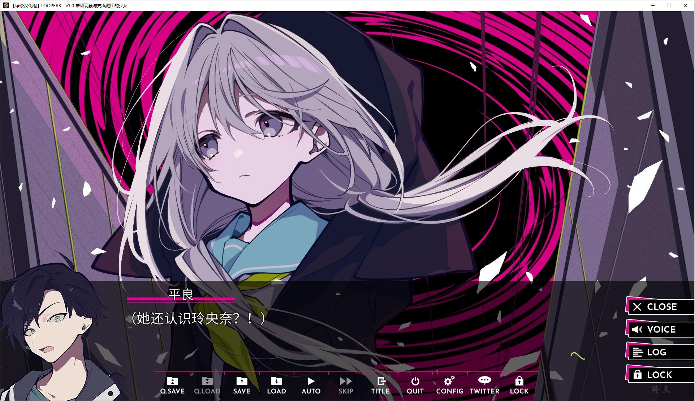

# 汉化版

# 官方中文

# 剧情介绍：

【泰拉（タイラ）】是热衷于GPS寻宝的高中生。
暑假的某一天，他和朋友兴高采烈地寻宝时，被卷入了不可思议的体验。

明天变成今天，现实与虚幻交错、理智让位于疯狂。
他们被“时间漩涡”所吞噬，被束缚于无限循环的今天的命运。

在那里相遇的，是同为“LOOPERS”的少男少女们。
队长【西蒙（サイモン）】，以及被神秘气氛包裹的少女【米娅（ミア）】

*（介绍来自2dfan）*

绿茶汉化组的汉化作品，详情请看汉化原帖

[发布原帖](http://tieba.baidu.com/p/7469577281)

---

2023-6-27 更新官方中文

游戏为终点论坛自购，转载请注明终点论坛，谢谢配合，
如有能力，还请支持正版

[STEAM地址](https://store.steampowered.com/app/1811500/LOOPERS/)（锁区）

**请使用[IDM](https://www.123pan.com/s/jJprVv-3tMsH)进行下载，使用最新版[winrar](https://www.123pan.com/s/jJprVv-dtMsH)进行解压（非常重要）。**

**解压密码为终点（简体汉字）。**

**添加10%恢复记录，防止网盘抽风损坏。**

