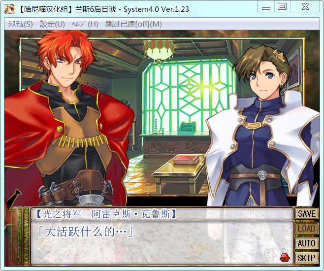
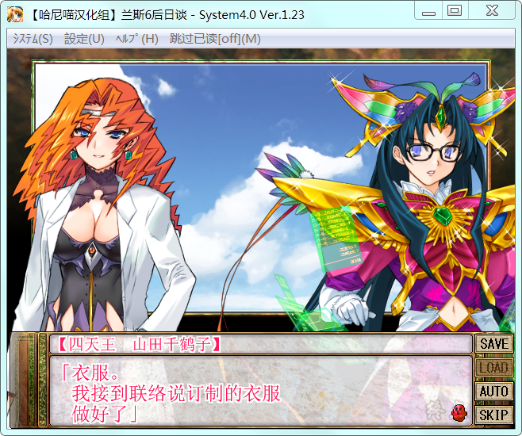

**兰斯6赛斯崩坏的后日谈，收录于爱丽丝之馆7中**

# 游戏简介

这次作品的舞台是和平富裕的魔法大国ゼス，时间是《兰斯5D》的剧情之后不久。身为一国国王，却眷恋流浪的剑士生活，到处冒险（乱来）的兰斯，终于又跟多年来冒险剑士的厄运碰头了——没钱。为赚钱接下到魔法王国ゼス完成任务的兰斯，到了极度重视魔法，鄙视不会魔法者的ゼス王国，因不会魔法而遭迫害，他的奴隶シィル却因身为魔法使得到优待。被投入狱中，憋着一口恶气的兰斯，出狱后加入反ゼス集团レジスタンス，并开始着手颠覆ゼス的行动。但实际上，他只是借解放国民大名，对抓来的坏魔法使进行“体罚”，把成为伙伴的女孩子召集起来过酒池肉林的生活，极尽鬼畜之能事…

游戏截图：

[汉化原帖](https://tieba.baidu.com/p/4748434018)

**请使用[IDM](https://www.123pan.com/s/jJprVv-3tMsH)进行下载，使用最新版[winrar](https://www.123pan.com/s/jJprVv-dtMsH)进行解压（非常重要）。**

**解压密码为终点（简体汉字）。**

**添加10%恢复记录，防止网盘抽风损坏。**

