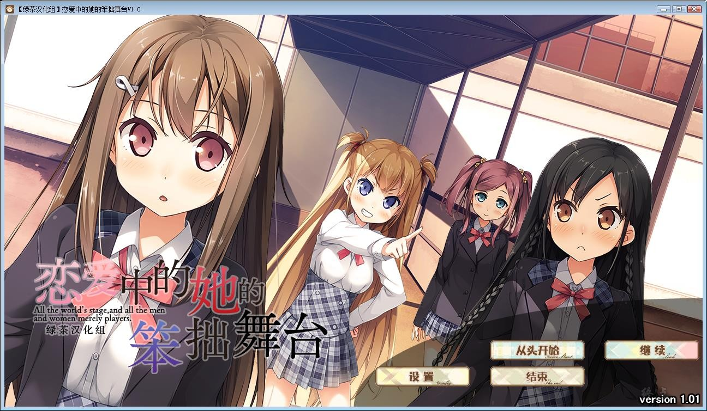
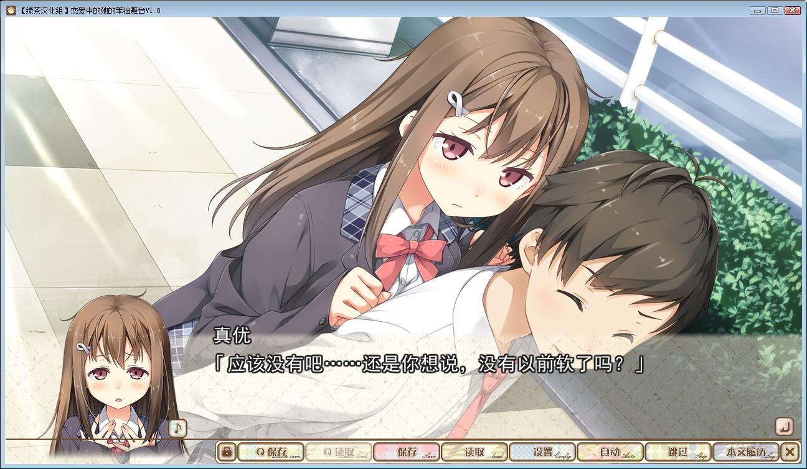
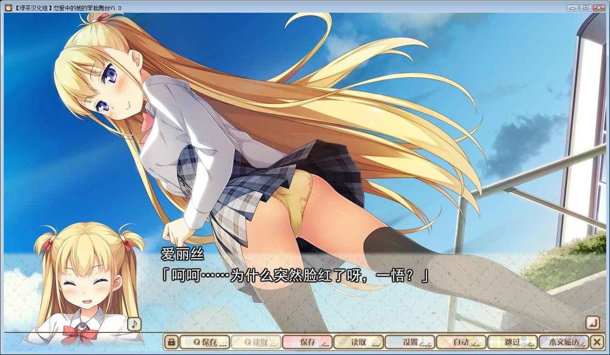
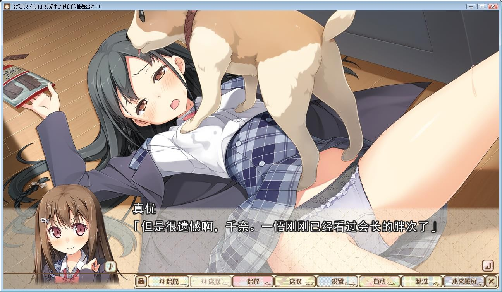
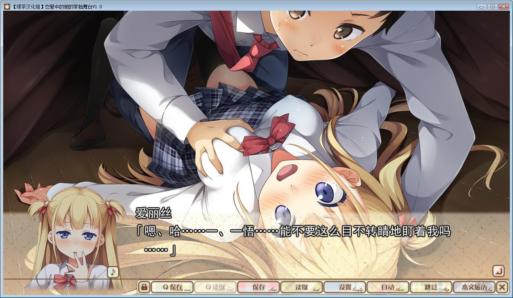
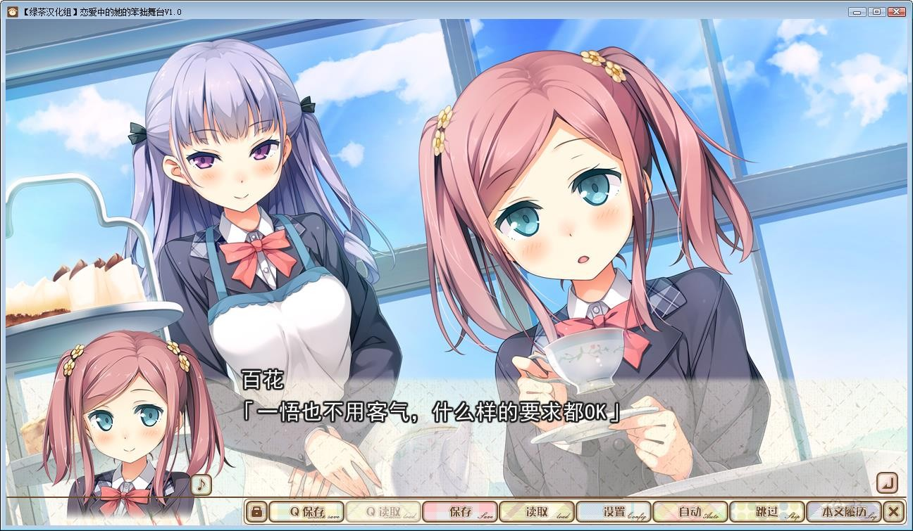
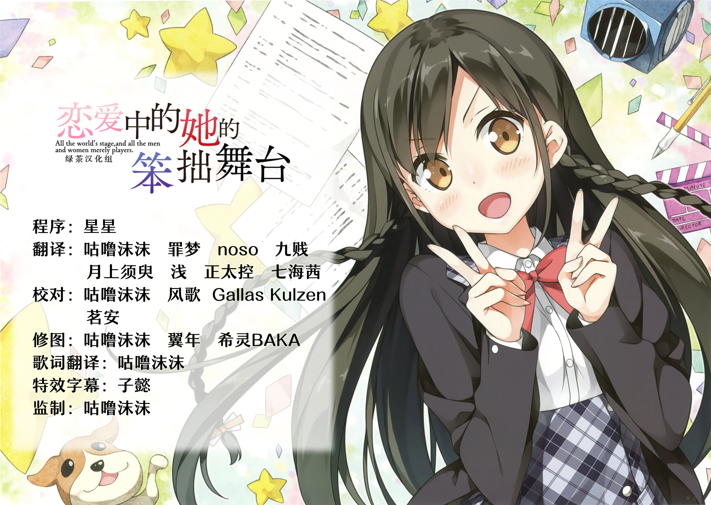

# 游戏简介

*（来自2DFan）*

私立 早久保学园、对于此校的学生来说最重要的活动、秋天的“文化祭”。

而临近的现在、全校生都向着它而开始准备、盛大充满热意的气氛充斥着学园。

——但、对于部员甚少的部团、总通称“弱小部”的人们来说却是抱头烦恼的活动。

其原因“如不在文化祭上成功完成学生会给予的课题、就会下达废部通知”这一麻烦的条件而起。

主人公·宮国一悟所属的文艺部也收到了其通知。

其课题是“文艺部如果不能卖出100册部团自制杂志的话就会被废部”。

学生会的理由是「如果文艺杂志被大家所需求的话、那也就了提供部室和部费的意义了」。

原女艺人、现文艺部员的青梅竹马·十川 真優 表示「我的归处会消失」这样为难困扰。

现役作家的后辈·七瀬 千奈 表示「除文艺部以外没有想参加活动的部团了」这样茫然困惑。

可文艺部所属仅仅3名的部员们、绞尽脑汁还是没有想到解决方法。

在这时、出现在他们面前提议一起联手的是演劇部部長·千代田 百花 （ちよだ ももか）。

「没有演出实际成果的演剧部称不上是演剧部。如不在这次的文化祭上成功出演的话、就下达废部通知」
虽然被学生会这般叮嘱、可演剧部只有2名部员。就这样上台表演那根本是不可能的。所以——

「想请文艺部来撰写剧本、并来参加出演！想让真優ちゃん再次作为女优站在舞台上！！」百花拜托道。

究竟文艺部和演剧部是否能顺利完成学生会给予的课题呢？

真優能再一次站在舞台上吗？而一悟与她们的恋缘到底会前往何方？

抱着各种复杂的心绪、文化祭的开典逐渐开始逼近——

**绿茶汉化组  三周年纪念  第二弹**

**详情请看** [汉化发布帖](https://weibo.com/ttarticle/p/show?id=2309404557911870275669&infeed=1)

汉化集成了官方V1.01修正补丁，内置全CG存档和攻略。

同时支持繁简中文，在游戏设置中切换后重启游戏生效。

小概率黑屏，这时候重启游戏，点击继续游戏即可解决。

**请使用[IDM](https://www.123pan.com/s/jJprVv-3tMsH)进行下载，使用最新版[winrar](https://www.123pan.com/s/jJprVv-dtMsH)进行解压（非常重要）。**

**解压密码为终点（简体汉字）。**

**添加10%恢复记录，防止网盘抽风损坏。**

