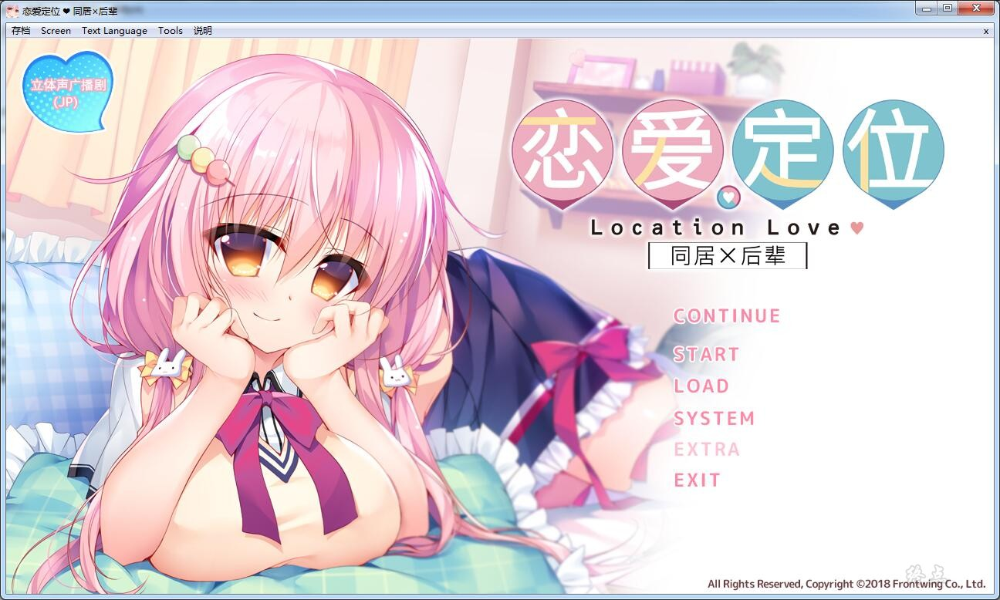
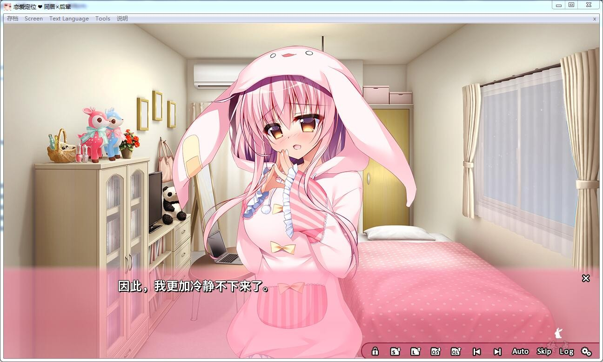
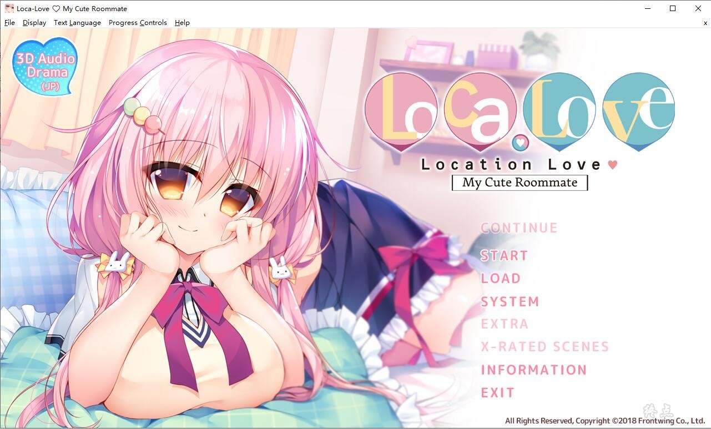
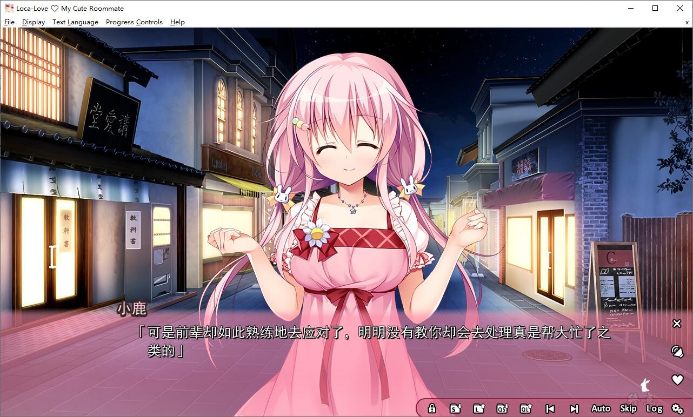
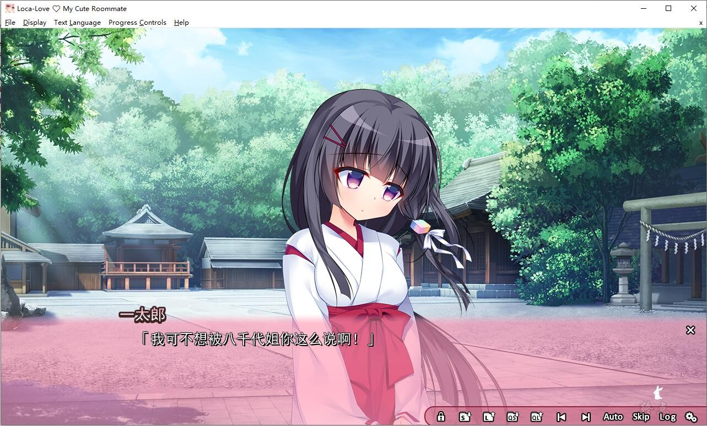
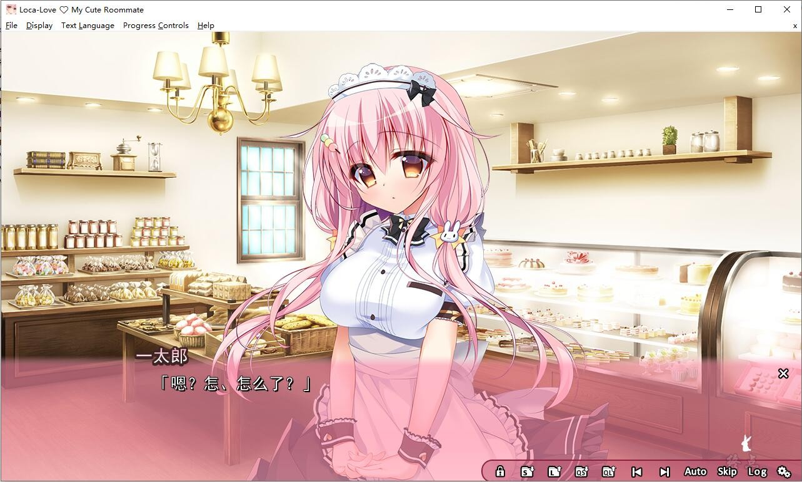

# 官方中文

# 汉化版

# 游戏简介

葵一太郎一直一个人独自生活，因为突如其来的事故的影响，他不得不暂时搬离自己的公寓。
然而，塞翁失马焉知非福，这个倒霉事却成了他美好生活的开端。

“既…既然这样那就请住到我家来！”

一太郎受到了兼职工作的后辈，小鹿日和的邀请。

他从很早就喜欢日和，因此当日和鼓起勇气发出了邀请后，两人开始了同居生活。

最初两人还因为紧张和羞涩而“相敬如宾”，
等互相之间都知道了对方的心意之后，同居生活就变得非常甜蜜。

无论是睡觉，吃饭还是上学，两人都如胶似漆，形影不离。

与日和一起度过的每一刻都充斥着纯粹的幸福。

一太郎希望两人这样甜蜜的生活一直持续下去，
而想要做到这点，他需要做到一件事…

Steam官方中文版，有能力请支持正版补票

**[Steam地址](https://store.steampowered.com/app/916060/LocaLove_My_Cute_Roommate/)**

**游戏为终点论坛自购，转载请注明出处。**

---

2022-05-28  更新兼容R18的中文版，H部份尚未翻译，只有日文和英文。感谢等来雨制作兼容补丁。

2022-6-29更新：黙示汉化组汉化版本，H部份已翻译。

**请使用[IDM](https://www.123pan.com/s/jJprVv-3tMsH)进行下载，使用最新版[winrar](https://www.123pan.com/s/jJprVv-dtMsH)进行解压（非常重要）。**

**解压密码为终点（简体汉字）。**

**添加10%恢复记录，防止网盘抽风损坏。**

