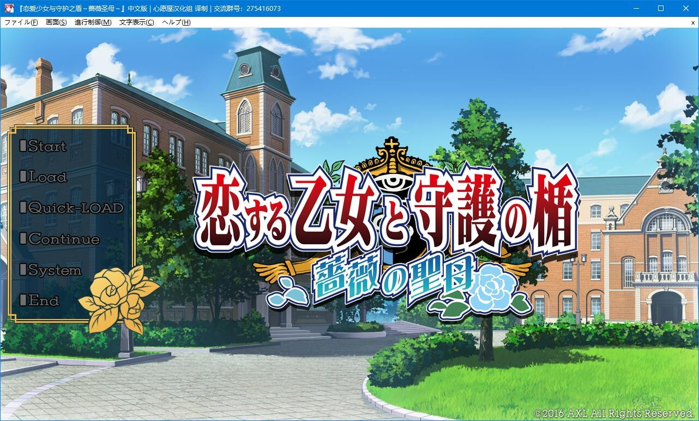
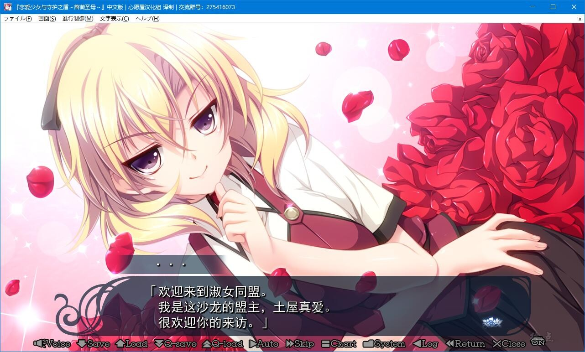
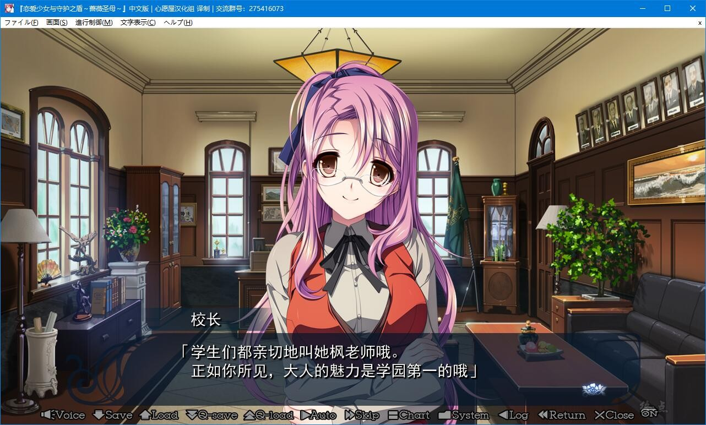
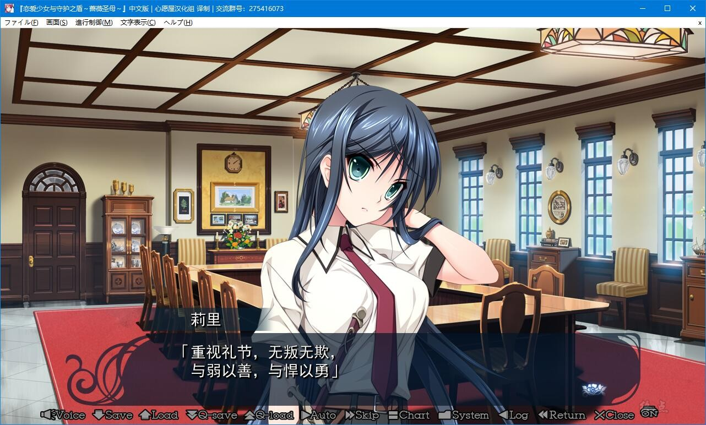
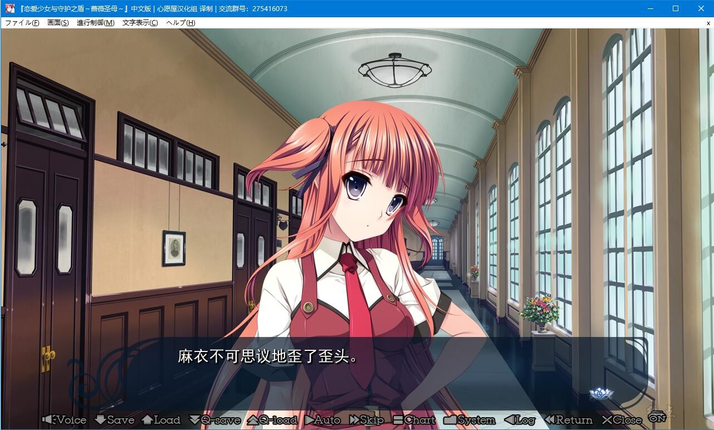
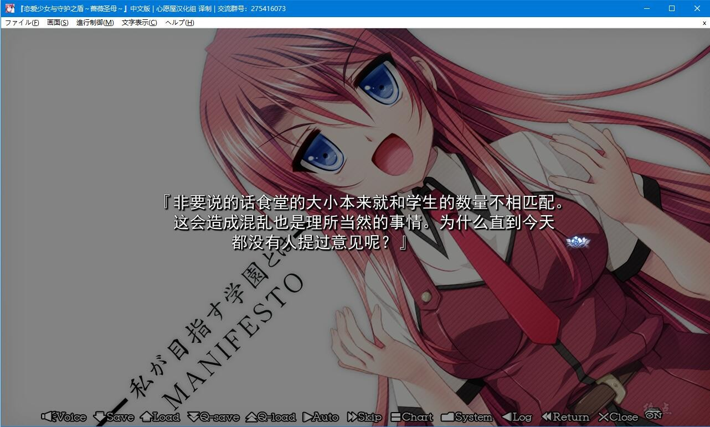

# 故事简介

シールド9的如月修史是，因セント・テレジア事件中的功绩被评价，在アイギス内建立起了稳固的立场的。

……“女装潜入担当”。

之后也来来回回数次进行潜入，修史终于累的连是不是该从アイギス里面辞职都开始考虑了。

[部长！已经可以不用在进行女装案子了吧！]

[抱歉！已经都接受了！这次、这次是最后了！只有头儿你了！]

虽然很生气但是对于作为养父的部长的拜托也没有拒绝，立下了这是最后的约定，就前往了和セント・テレジア相同的大小姐学园。

[这次的任务是，你要，作为这个学校的学生会会长后补，并且取胜]

[啊！？]

[而且，有工作员数名，虽然已经先行一步潜入但因为任务上的规定而无法告诉你。祈祷你凯旋而归]

没有任何支援的转入了超大小姐学园，参加迫在眉睫的2个月后学生会会长选举，还不得不成功的竞选成功这样的胡来。

而且虽好像还有同伴但完全不告知其是谁。难题难的也有个限度吧。

但在其背后可存在着，只要成为了学生会会长的话就杀掉的预告犯。

外加聚集着学园关系者的女儿的“淑女同盟”和自治组织“学园委员会”互相对立。

在其影子下还存在以学园的传统名为名所实行的坏事和二重的陷阱……

如月修史成为学生会会长的话，能够解开这已经打结的线吗？

[一定会守护你的。所以，请……相信我]

*（介绍来自2dfan）*

心愿屋汉化组的汉化作品

**请使用[IDM](https://www.123pan.com/s/jJprVv-3tMsH)进行下载，使用最新版[winrar](https://www.123pan.com/s/jJprVv-dtMsH)进行解压（非常重要）。**

**解压密码为终点（简体汉字）。**

**添加10%恢复记录，防止网盘抽风损坏。**

