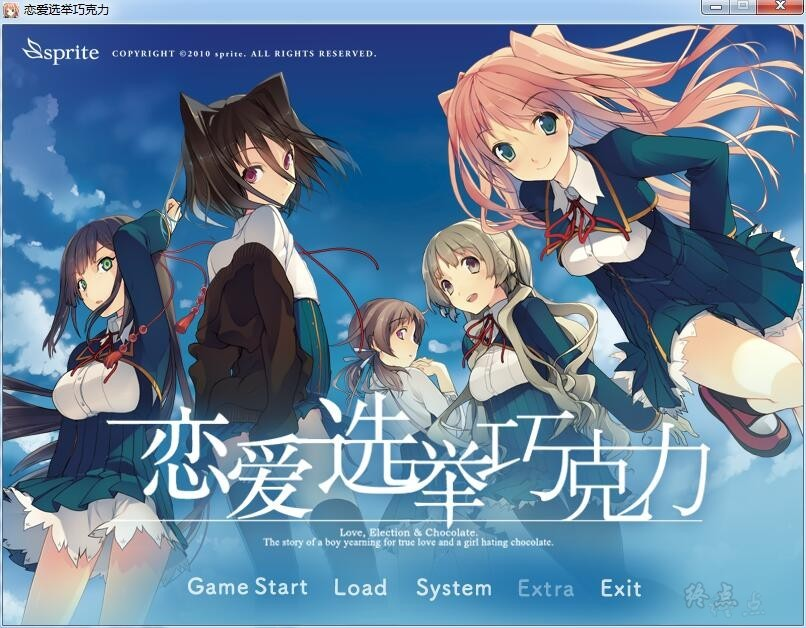
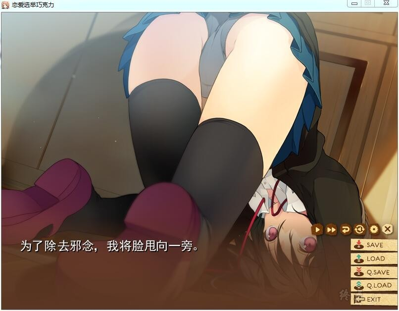
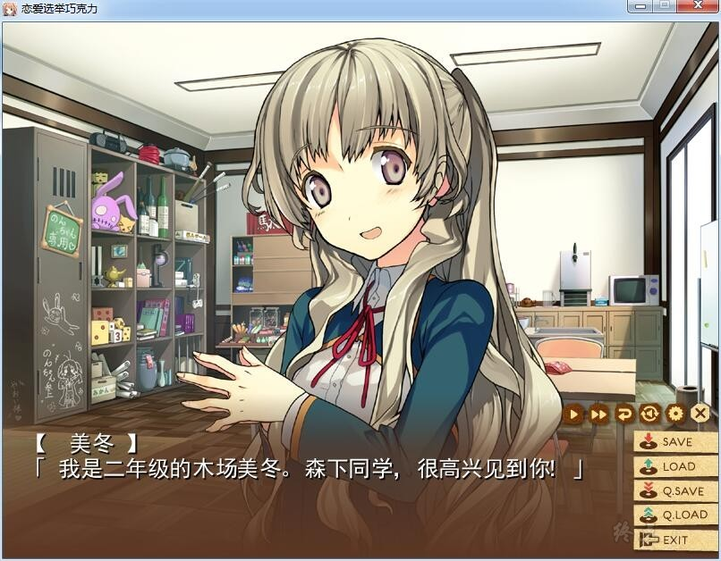
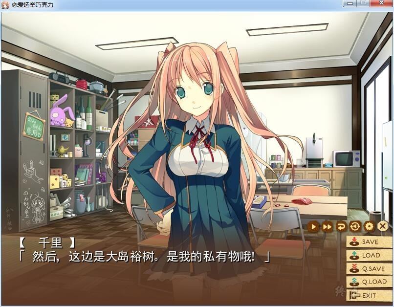
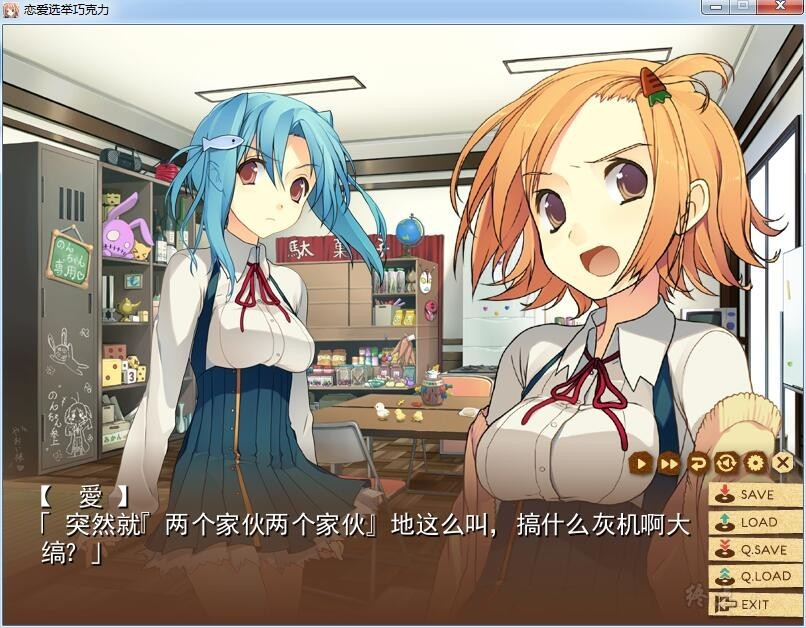
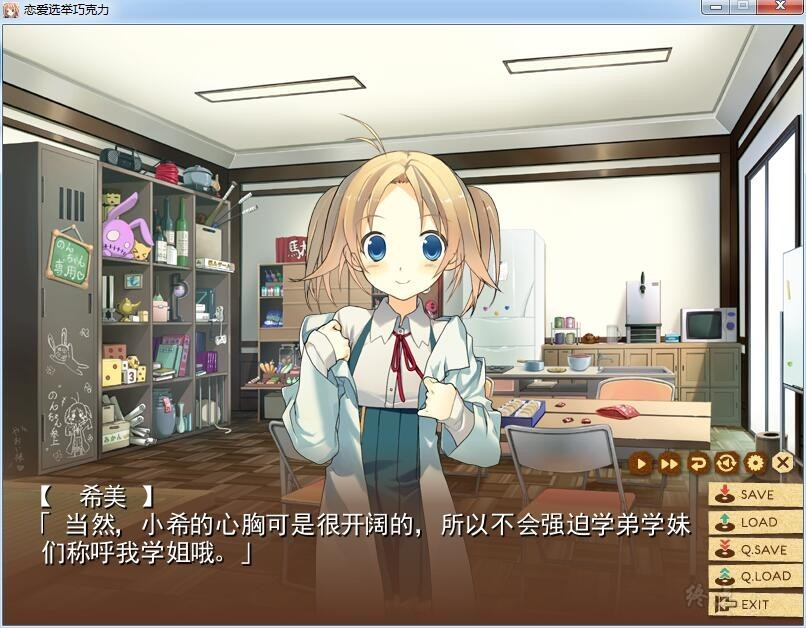
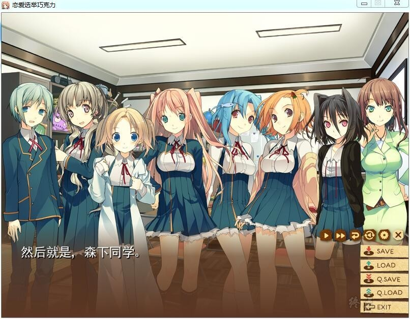
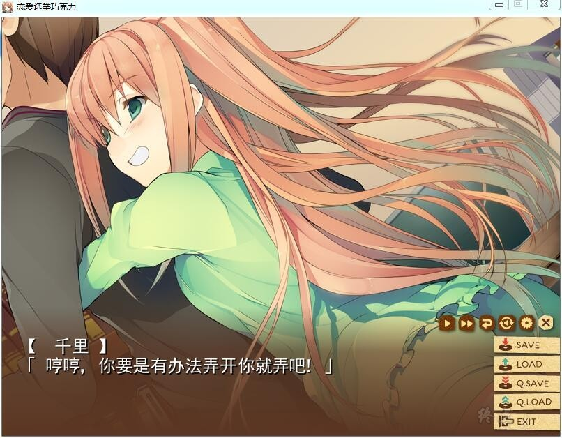
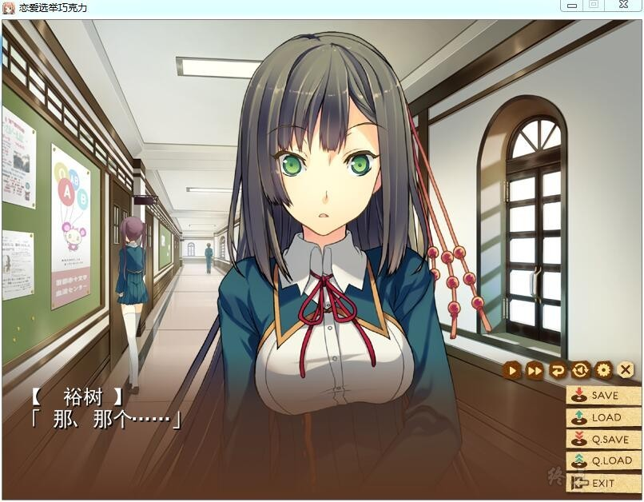

# 游戏简介

故事主要讲述了主人公大岛裕树与青梅竹马住吉千里以及从以前起就是好友的同班同学木场美冬就读于以拥有超过五千名学生而自豪的工业学园“私立高藤学园”，同时他们还是以吃点心作为活动内容的社团食品研究部（通称：食研）的成员。次期自治学生会长的强力候选人东云皐月誓言要整顿杂乱且无实绩的社团活动，而其中食研更是首当其冲被指名要将其废部。为了避免面临危机的食研被废部，部员们想方设法开始行动起来了。

# **注意**

运行 楒偲慖嫇偲僠儑僐儗乕僩.exe 开始中文游戏
首次运行出现密钥输入框时，随便输入一连串数字，然后回车即可开启游戏。

例如：11111111111111111111111111111111

然后回车。

注意不要修改主程序文件名，保持乱码状态。

My萌汉化组的作品

[汉化原帖](https://tieba.baidu.com/p/2390471105)

**请使用[IDM](https://www.123pan.com/s/jJprVv-3tMsH)进行下载，使用最新版[winrar](https://www.123pan.com/s/jJprVv-dtMsH)进行解压（非常重要）。**

**解压密码为终点（简体汉字）。**

**添加10%恢复记录，防止网盘抽风损坏。**

