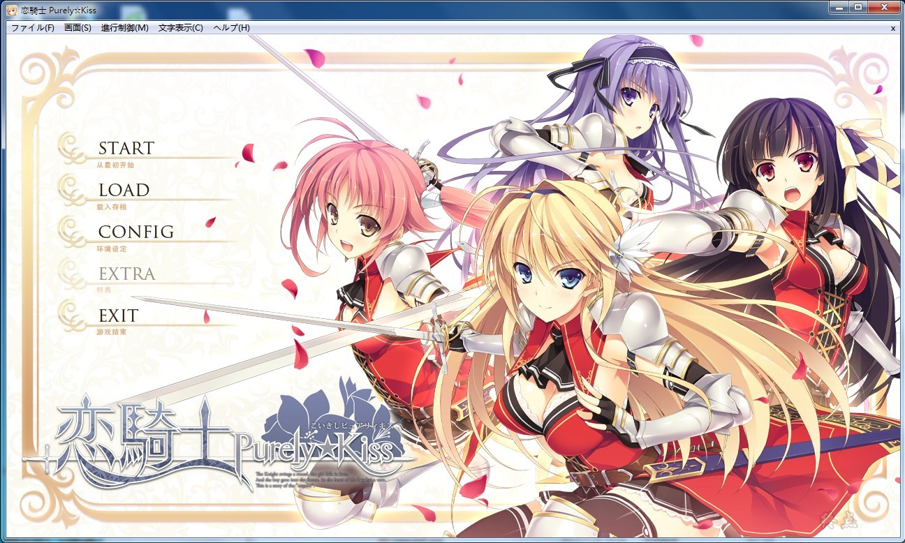
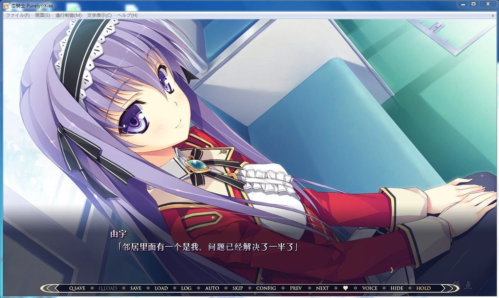
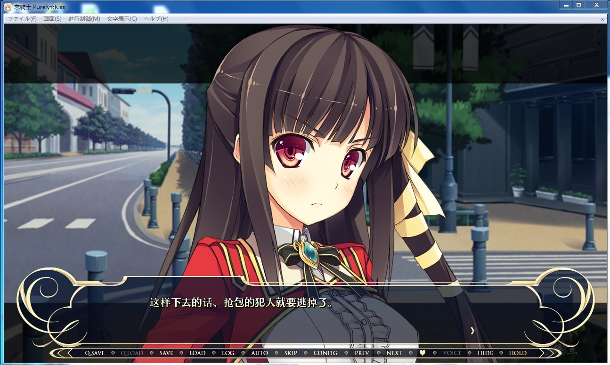
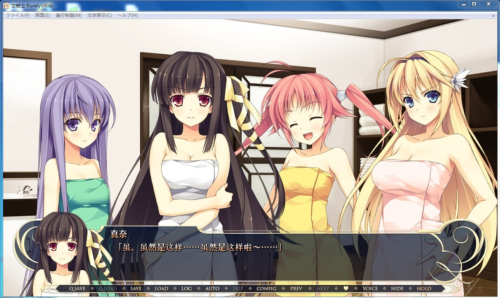

# 游戏简介

我，藤守要曾经在小时候被骑士救下一命。

那一天，满眼净是灼红烈焰与瓦砾。

那一天，自以为无所不能的优越感也在无能的自我面前灰飞烟灭。

然而，让我的心变得火热的却并非绝望，而是救出我的骑士那飒爽英姿。

也就是那一天，我立下誓言——总有一天，我要成为能够守护众人的骑士。

时光飞逝，如今我来到培养骑士的专业学校白宫学园。

而迎接我的，正是某个骑士团的入团仪式。

白宫附属骑士团“伊斯库瓦亚”——为了选拔出学生骑士而设立的机构。

那里还有接下来将共同行动的伙伴们在等着我。

……

话说，为什么全是女孩子呢？团长，什么情况？咦，男生就我一个！？

不要紧啦……不要紧……的话就好了。

虽然难免不安，不管如何，骑士之路的第一步已然迈出……

心愿屋汉化组的作品

2018-07-05  添加Win10兼容版本（弟弟制作）

2020-08-12  资源被封，两个版本全部重新压制（度盘）

2020-11-18  更新Win10兼容V2版本（弟弟制作）

**请使用[IDM](https://www.123pan.com/s/jJprVv-3tMsH)进行下载，使用最新版[winrar](https://www.123pan.com/s/jJprVv-dtMsH)进行解压（非常重要）。**
**解压密码为终点（简体汉字）。**
**添加10%恢复记录，防止网盘抽风损坏。**