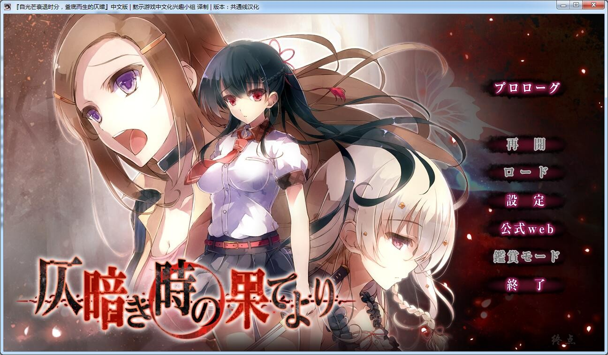
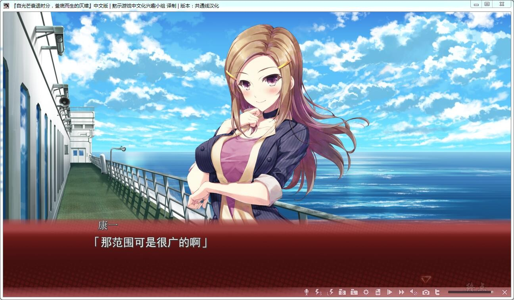
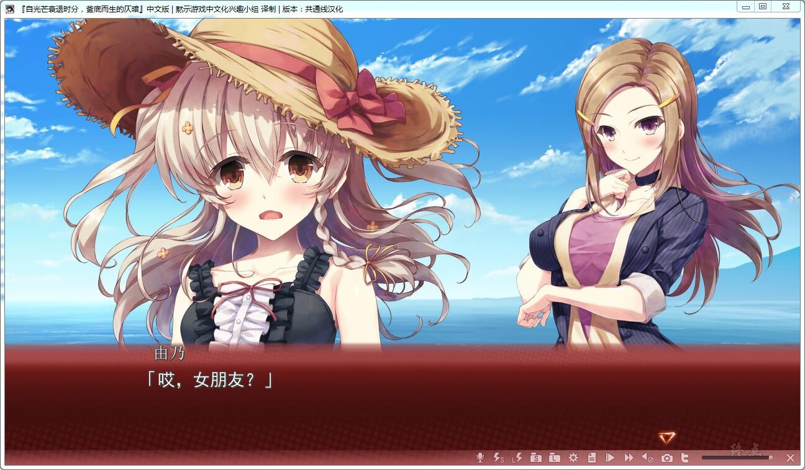
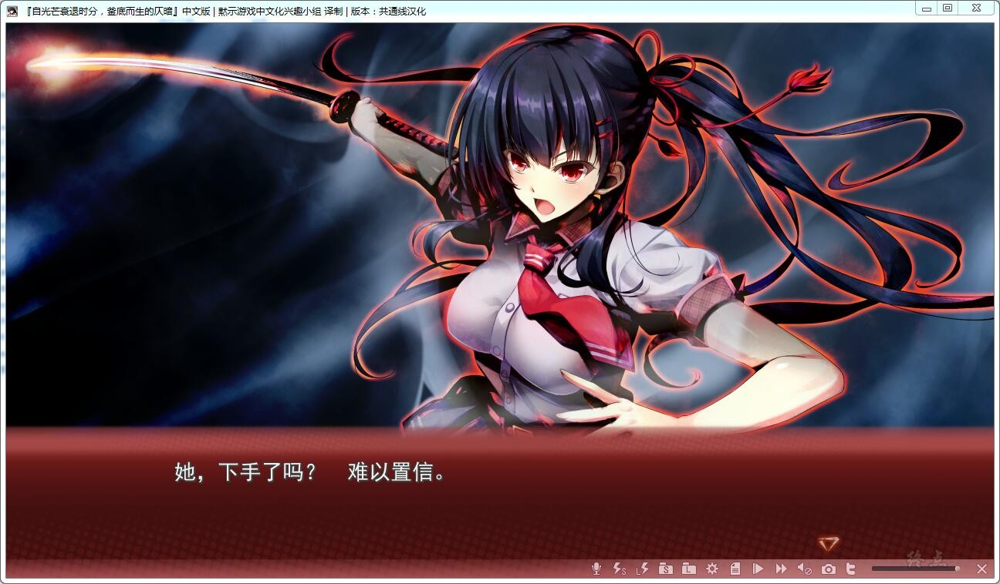
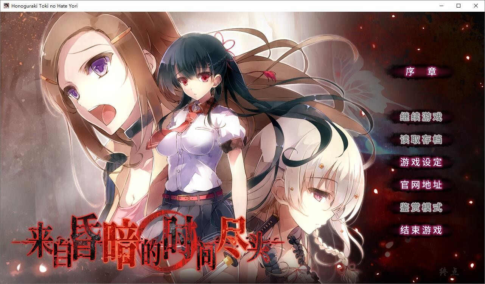
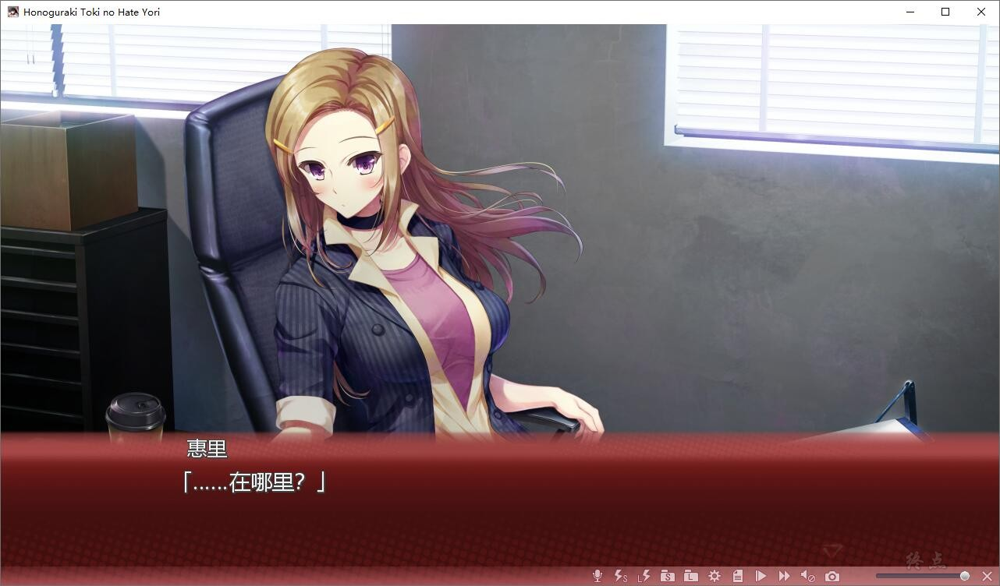
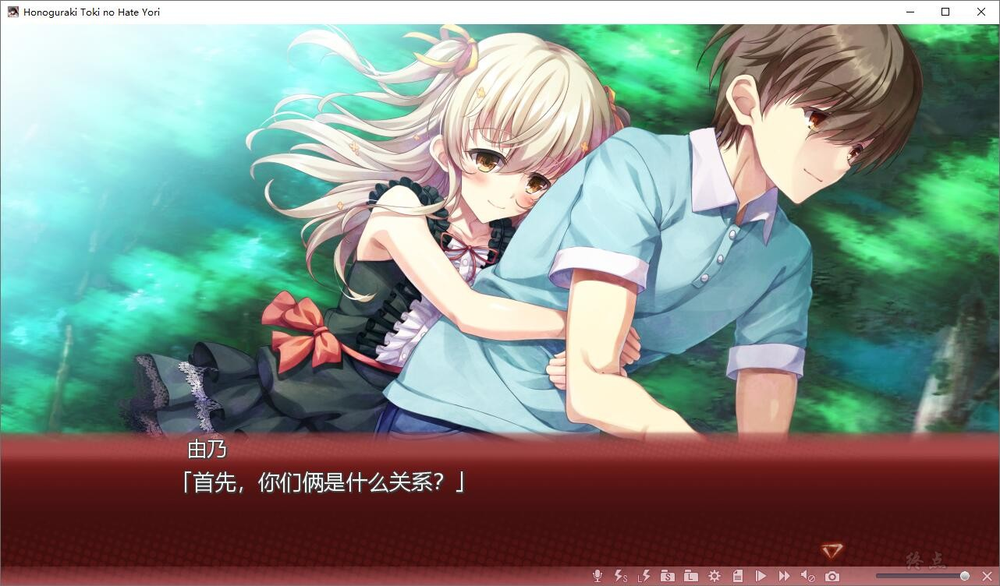
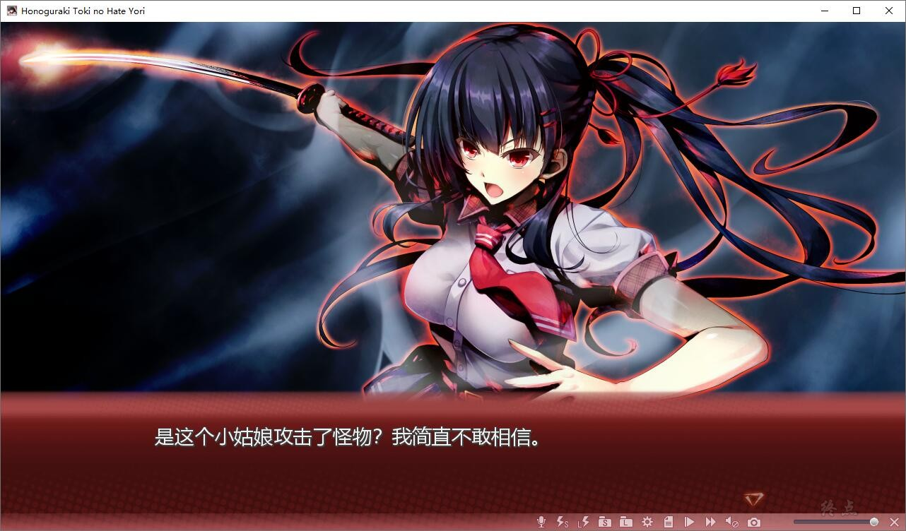
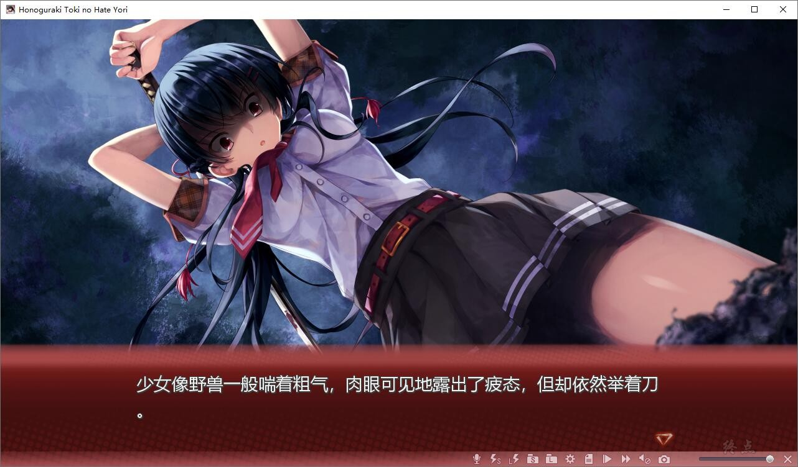

# 汉化版

# 官方中文

那是，禁断的———初夏。

御城康一回到了故乡的小岛。在港口迎接自己的妹妹。

双亲一直经营着的旅馆。以及那毫无变化的街道、一切的，一切，都和以前没什么变化的世界，没有什么改变、御城康一的世界。

但——

那阳光下的世界，却并非世界的全貌。

当明月升起，夜空高挂之时，魍魉们睁开了紧闭的双眸，
向着生者伸出了，那肮脏的，沾满腥腐的，利爪——

“怪物”

人们怀着敬畏之情，将非人之物如此称呼。

那——

是御城康一所不知道的世界。

“怪物”出没的小岛，狩猎着“怪物”的少女。

徘徊在深夜的恐惧，以及为了紧握那些许“光明”而不断“战斗”的少女。

而本该与这些“异端”无缘的康一，生活在“阳光”之下的康一，——在那个被怪物袭击之夜以前的康一

那是 如此污秽 却又如此圣洁的画面。

那是 令人作呕 却又令人着迷的场景。

那是 禁忌的领域。

那是 禁断的门扉。

那是普通人的康一本不该目睹之物。

由黑暗而来的“怪物”，肮脏 凶恶 疯狂 恐怖。

持长刀战斗的“少女”，美丽 圣洁 清楚 凛然。

那一夜御城康一见到了从那灰暗之刻的尽头涌动而来的——“绝望”的物语。

黙示汉化组的作品，完整汉化已经放流了，注意更新
详情请看下面的汉化原帖

[汉化原帖](http://tieba.baidu.com/p/4959801912)

---

2021-12-17更新HIKARI FIELD官方中文，已打补丁简繁双版本（独立）

[HIKARI FIELD地址](https://store.hikarifield.co.jp/shop/honoguraki)

HF官中为终点论坛自购，转载请注明终点论坛，谢谢配合

如有能力，还请支持正版

**请使用[IDM](https://www.123pan.com/s/jJprVv-3tMsH)进行下载，使用最新版[winrar](https://www.123pan.com/s/jJprVv-dtMsH)进行解压（非常重要）。**

**解压密码为终点（简体汉字）。**

**添加10%恢复记录，防止网盘抽风损坏。**

