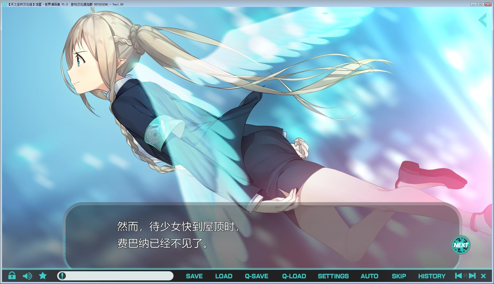

**天之圣杯汉化版**

**黙示汉化版**

**Johren官中版**

# **游戏简介**

（来自2DFan） 

**苍月射落之日，向着境界的彼方——  【第七共和国】。在守护这个国家安全的警察组织【警察厅】中，有着被当做麻烦聚集所的部门，【十三课】。 【日流路加】作为刑警的能力手腕都是一流的，但那总是问题不断的出格言行， 和对曾经引起了悲惨事故的【某起事件】异常的执著心，使得他被组织上层部视作了问题儿童。 结果：日流路加被转入了问题的十三课。  从而原本天涯孤独一匹独狼的路加，不得不同新配属的精灵族新人刑事【克拉丽丝】组成了搭档。  就这样被强组在一起，对彼此来说乃是最糟糕的【无能新人】和烦人的【无用上司】相性不合的两人。 这样宛如拷问的搭档日子里，随着一名逃亡到第七共和国的【少女】被保护。 本以为一成不变的日常，迎来了巨大的转变。**

---

**黙示汉化组 汉化作品，双线汉化
详情请看 [汉化发布帖](https://tieba.baidu.com/p/6184155874)**

---

**天之圣杯汉化组 汉化作品
详情请看 [汉化先行体验版](https://tieba.baidu.com/p/6306020588) [汉化正式发布帖](https://tieba.baidu.com/p/6335635171)**

---

**Johren官方中文版，有能力请支持正版补票
[Johren地址](https://www.johren.games/games/download/meteor-world-actor-en-zh/)**

---

**请使用[IDM](https://www.123pan.com/s/jJprVv-3tMsH)进行下载，使用最新版[winrar](https://www.123pan.com/s/jJprVv-dtMsH)进行解压（非常重要）。**
**解压密码为终点（简体汉字）。**
**添加10%恢复记录，防止网盘抽风损坏。**