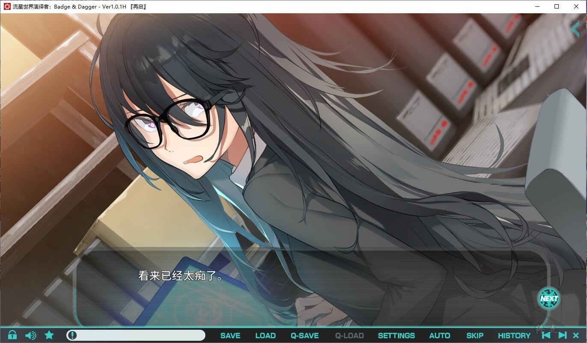
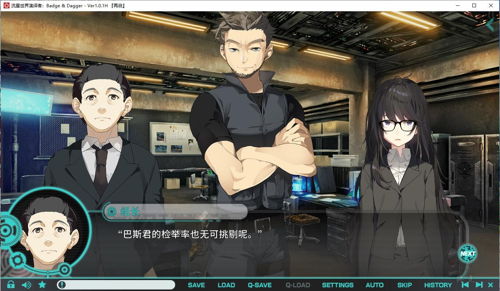
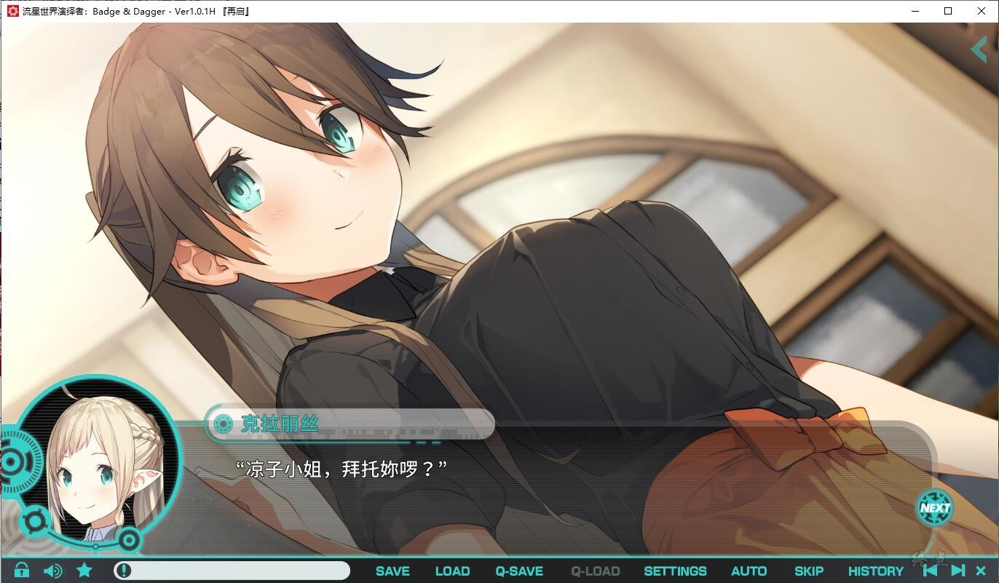
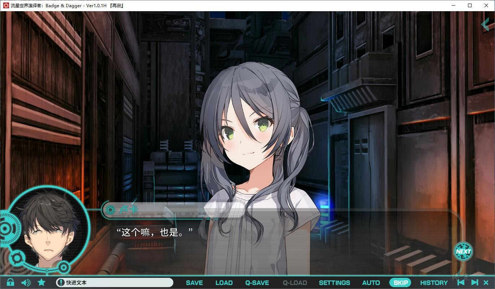

不被太阳眷顾的国家──第七共和国。
因为过去的大战失去了阳光的这个国家，遭受凶恶犯罪者和看不见的阴影肆虐。
而对抗罪恶守护民众的便是正义组织──警察厅。

主角日流卢卡，隶属于警察中棘手、问题人物聚集的十三课（通称：箱角）。
在没有重大案件的日子裡，卢卡私底下对过去发生的“教团事件”进行搜查。
某一天，加入了十三课的新成员让搜查出现曙光。

警察组织内流传著一个可疑的传闻，存在本身就是谜团的“闪耀同盟”。
在蠢蠢欲动的各种心绪中，等在卢卡、十三课、警察组织前方的究竟是……

游戏为终点论坛自购，转载自终点论坛。
如有能力，还请支持正版。
[Steam地址](https://store.steampowered.com/app/1819160/Badge__Dagger/)

已打补丁
2022-6-10 感谢nene的技术帮助，重压了硬盘

**请使用[IDM](https://www.123pan.com/s/jJprVv-3tMsH)进行下载，使用最新版[winrar](https://www.123pan.com/s/jJprVv-dtMsH)进行解压（非常重要）。**
**解压密码为终点（简体汉字）。**
**添加10%恢复记录，防止网盘抽风损坏。**