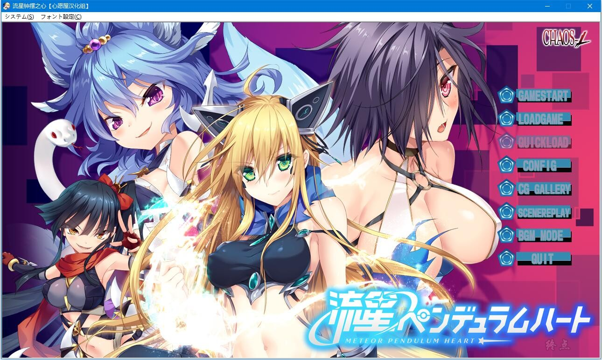
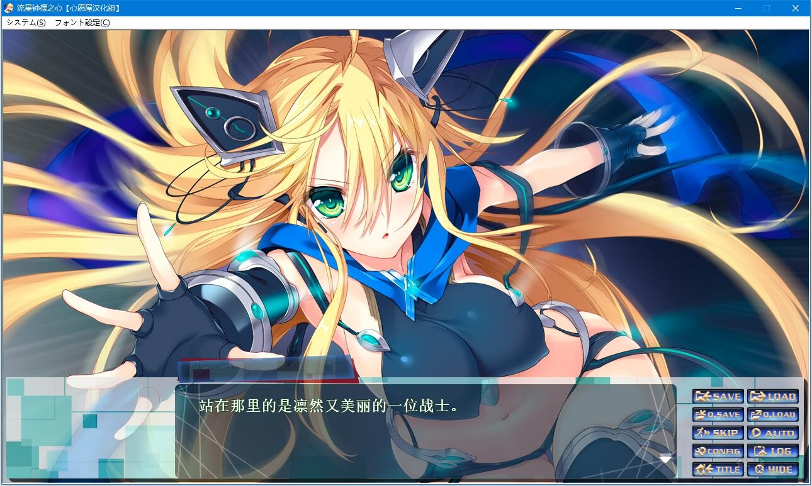
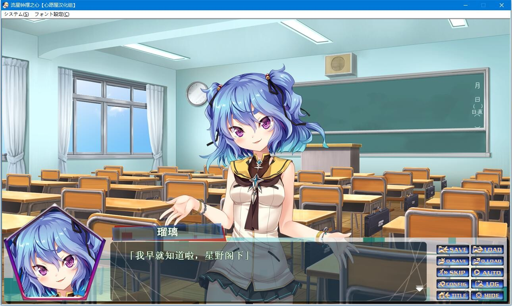
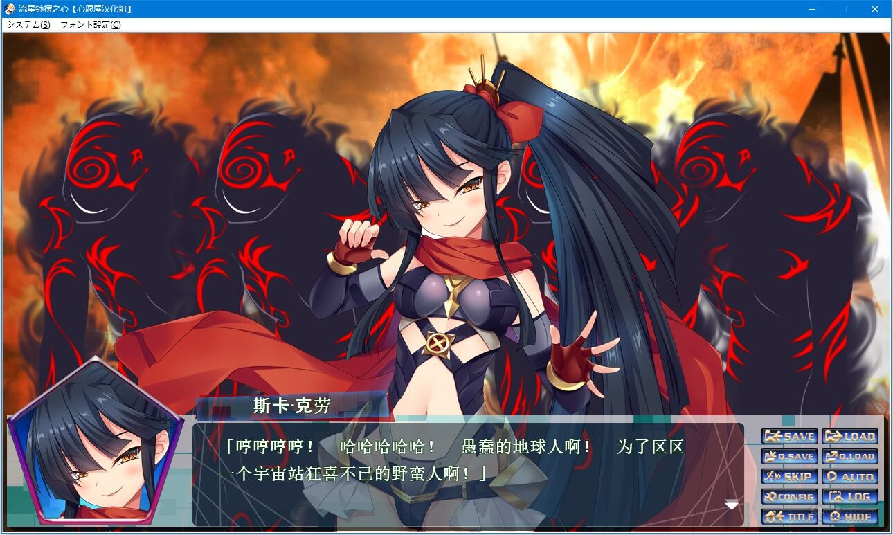
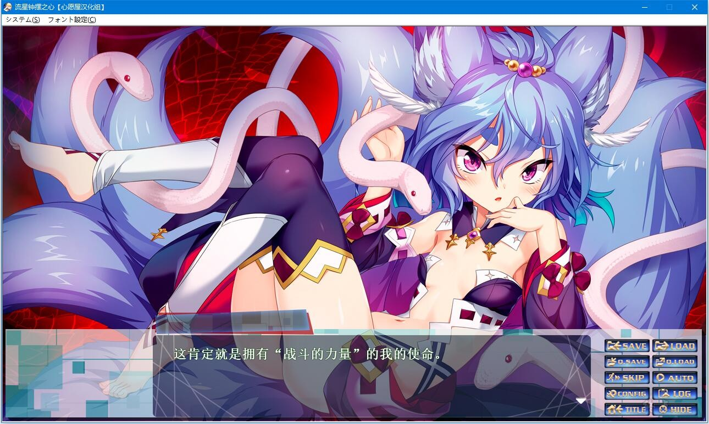
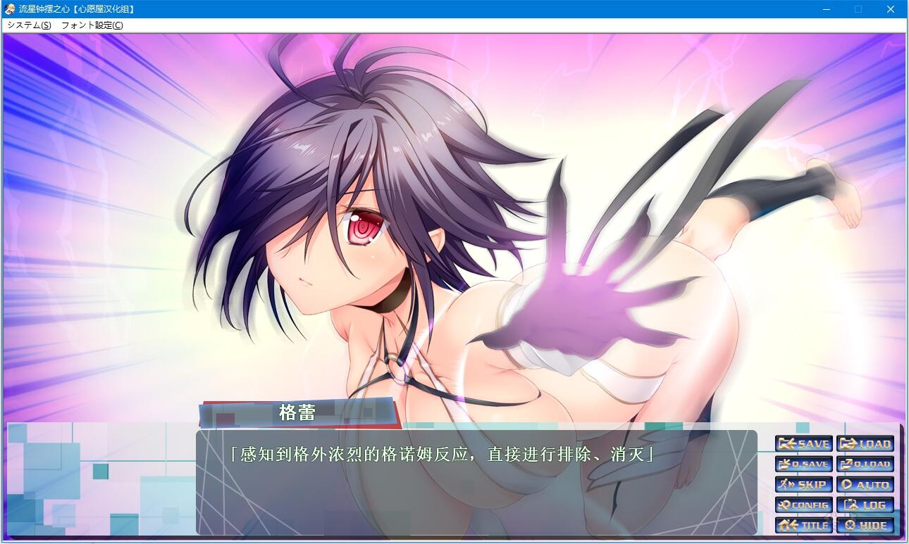

帅气的，可爱的，色色的……我的同伴！

在世界第一座多国籍移民型宇宙空间站《A.R.R.T(阿拉拉特)》盛大的揭幕典礼上，A.R.R.T被不知名人士所破坏了。

紧接着，银河犯罪组织克莱内布拉发布了对地球人类的宣战布告，并基于人类歼灭计划而同时开始了攻击。

在四处逃窜的人们之中，一名少女挺身而出对抗外星人的侵略。

她正是银河刑警库杜莎。

是从泛银河警察机构（Pan Galaxy Police Organization、略称PGPO）派遣过来的[屏蔽]。

她身着银河警察的战斗装备“摇摆骨架”，一次次地击退克莱内布拉的战斗员。

然而，克莱内布拉手上仍然留有着对付库杜莎的王牌。

持有该王牌的主人公，星野海。

库杜莎、克莱内布拉，面对来自双方的接触，几近极限状态的他究竟会选择哪一方呢？

*（介绍来自2dfan）*

心愿屋汉化组的汉化作品

2021-6-15日更新步兵，自带切换bat

**请使用[IDM](https://www.123pan.com/s/jJprVv-3tMsH)进行下载，使用最新版[winrar](https://www.123pan.com/s/jJprVv-dtMsH)进行解压（非常重要）。**

**解压密码为终点（简体汉字）。**

**添加10%恢复记录，防止网盘抽风损坏。**

