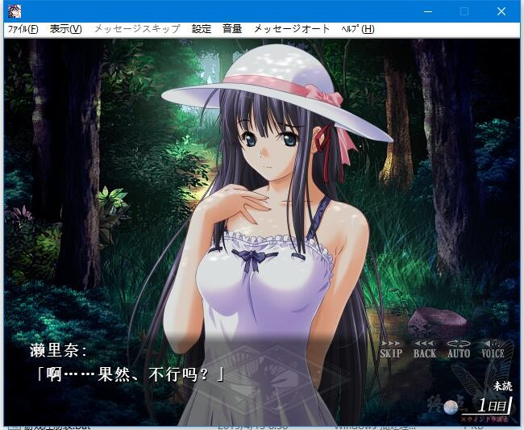

# 故事简介

座落在深山盆地中的偏僻小镇“上森村”……

这是个与世隔绝的闭塞村庄。

研究民俗学的好奇心旺盛的大学生高阪直人，在即将进入漫长暑假的7月的某日，受到了已经失踪了数月的恩师的来信。对信中内容产生了兴趣的直人，本着调查的目的，决心赶往深山中的神秘村庄“上森村”。
上森村座落在偏僻的深山里，每日仅有1班巴士运行。在坐车赶往那里的过程中，直人在车上结识了可爱的少女周防瀬里奈。直人得知瀬里奈出生于上森村，但因故在小时候就离开了这个村子。本来已经淡忘了这事的瀬里奈，却在最近受到了行踪不明的父亲的来信，让她又重拾这段记忆。

瀬里奈和直人在村里遇到的竟然是一群古怪的男人们以及他们妖艳的太太，还有每每在夜里才会现身的神秘少女。

瀬里奈回到了生养自己的周防家，直人也跟着寄宿在了这里，开始了他的调查工作。

瀬里奈也加入了直人的调查工作中，两人每日都在一起。就这样，两人的关系渐渐地拉近了，然后……

*(介绍来自2dfan)*

心愿屋汉化组的汉化作品

首次启动运行注册表

如果游戏卡住，请切换原版跳过后存档

这游戏我测试会缺字，测试系统为win10，win7系统的可以试试

**请使用[IDM](https://www.123pan.com/s/jJprVv-3tMsH)进行下载，使用最新版[winrar](https://www.123pan.com/s/jJprVv-dtMsH)进行解压（非常重要）。**

**解压密码为终点（简体汉字）。**

**添加10%恢复记录，防止网盘抽风损坏。**

