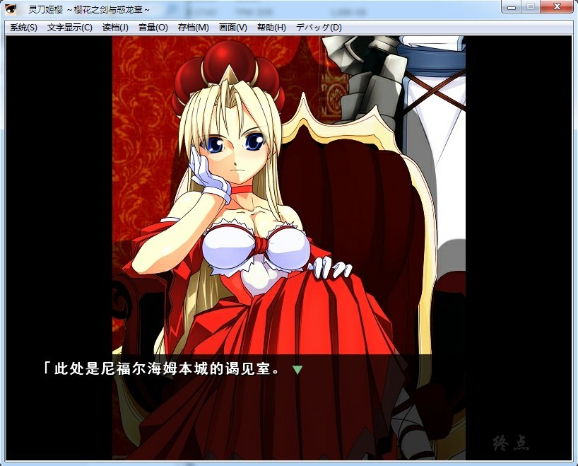

# 游戏简介

原名：霊刀キザクラ～桜花の剣と惑竜章～

译名：灵刀姬樱 ～樱花之剑与惑龙章～

制作：雨伞日伞事务所

发售日期：2008-10-24

介绍页：http://kizakura.sakura.ne.jp/index01.htm

从游戏的角度来说，本作属于雨伞日伞事务所的名物系列《エリュズニール》系列中的外传性质，所以如果没玩过前几作的童鞋可能对本作的故事背景及相关人物等不太了解

所以玩过这作之后对本系列感兴趣，而没有接触过之前的作品的玩家可以去玩一下关联作品（如下）：
《黒曜镜の魔獣》、《隷妃双奏》、《红湖の皇子》
后续关联作：《ヴィザルの日记》、《嘘つきナレットの优しい暗杀者》

本系列拥有庞大的世界观，华丽的战斗特效，欢乐的日常情节，细腻周到的描写，可以说算是同人作中非常优秀的一个系列（画风什么的见仁见智了www

**请使用[IDM](https://www.123pan.com/s/jJprVv-3tMsH)进行下载，使用最新版[winrar](https://www.123pan.com/s/jJprVv-dtMsH)进行解压（非常重要）。**

**解压密码为终点（简体汉字）。**

**添加10%恢复记录，防止网盘抽风损坏。**

