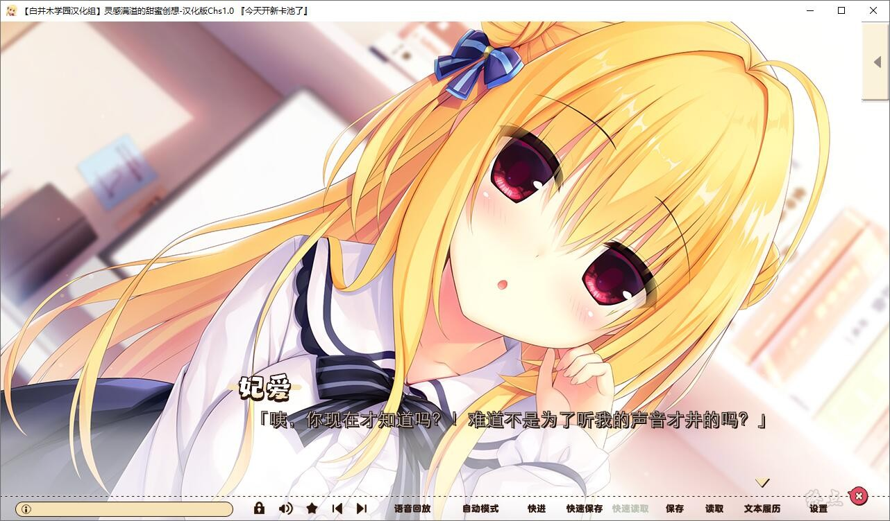

# 剧情介绍：

还是这个季节，一转眼到了6月底。

大家公认的隐士【和泉智宏】，今天也本该在教室偏安一隅，度过平静的一天，然后......

“米娜桑~~~(≧▽≦)~~~恭喜和泉菌成功当选本届的学生会会长

学校也不知道哪根儿筋搭错了，突发奇想决定靠抽签选举学生会长，再然后就是男主倒霉地中招。

突然成为学院焦点的男主，成为了学生们茶余饭后的谈资。

走投无路的男主开始依靠秘书之手召集同伴，然后问题来了——

无论是同级生的【常磐 華乃】，还是身为后辈的【錦 あすみ】，甚至是自己的妹妹【和泉 妃愛】，一个都没来上过学Σ(っ °Д °;)っ

火上浇油的是，失联N久的前任会长【鎌倉 詩桜】也现身了......

这究竟是人性的缺失，还是道德的沦丧？

请收看稍后播出的《今日签法 · 旷古烁今的石乐志学生会会长之战》

*（来自2dfan）*

白井木学园汉化组的汉化作品，详情请看汉化原帖

[发布原帖](https://tieba.baidu.com/p/7516019707)

2021-8-29 更新1.1汉化

2022-8-21 更新1.3汉化

2023-3-28 更新，常轨脱离Creative官中，移植官中版本，**[转载地址](https://kf.miaola.work/read.php?tid=984245&sf=a06)**。**适配日版，但是需要hamidashi改成root，否则会报错，已打日文1.10升级档和立绘补丁**

**请使用[IDM](https://www.123pan.com/s/jJprVv-3tMsH)进行下载，使用最新版[winrar](https://www.123pan.com/s/jJprVv-dtMsH)进行解压（非常重要）。**

**解压密码为终点（简体汉字）。**

**添加10%恢复记录，防止网盘抽风损坏。**

