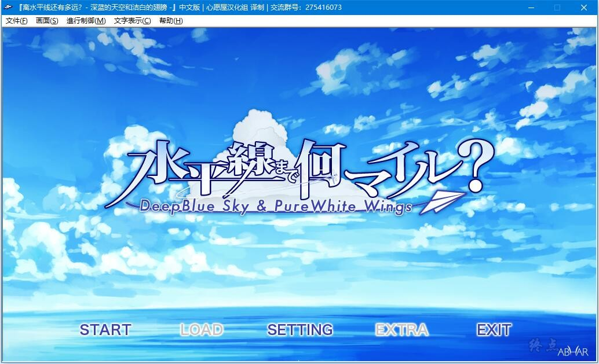
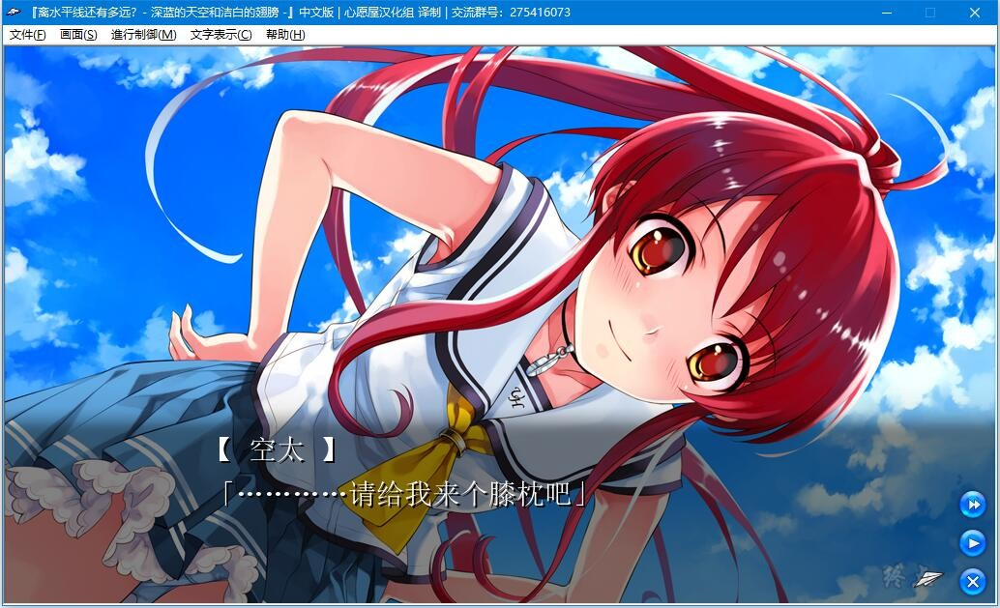
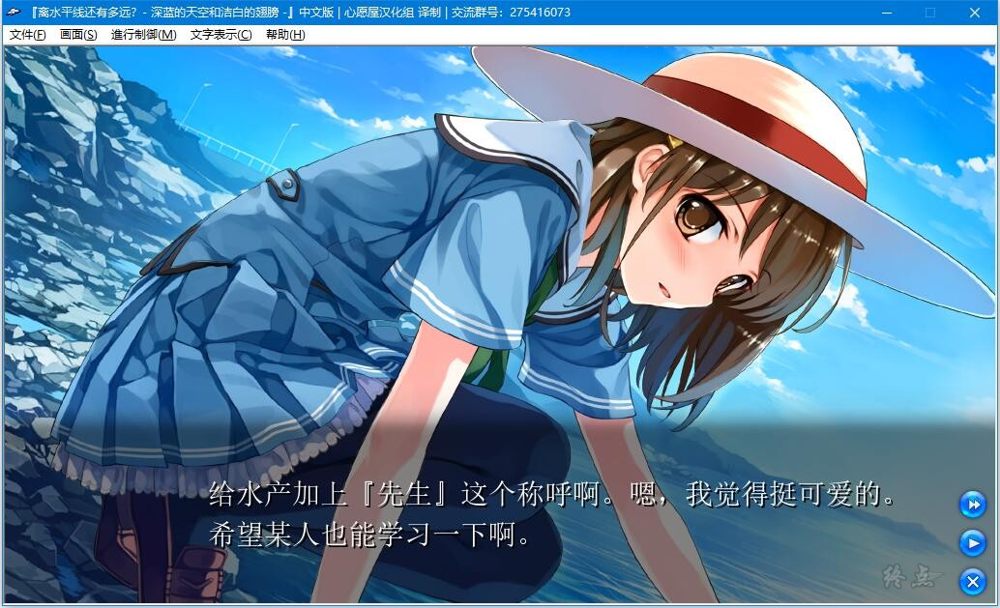
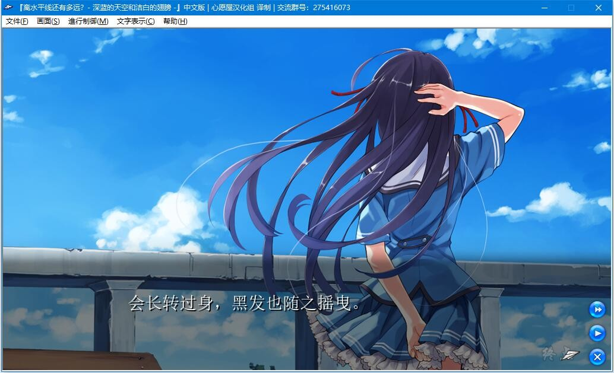
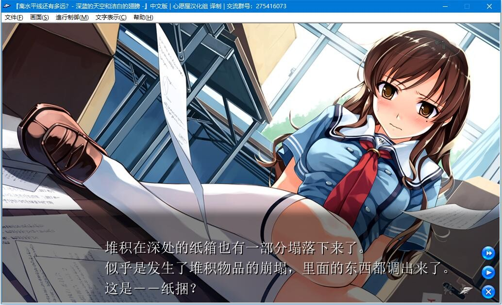
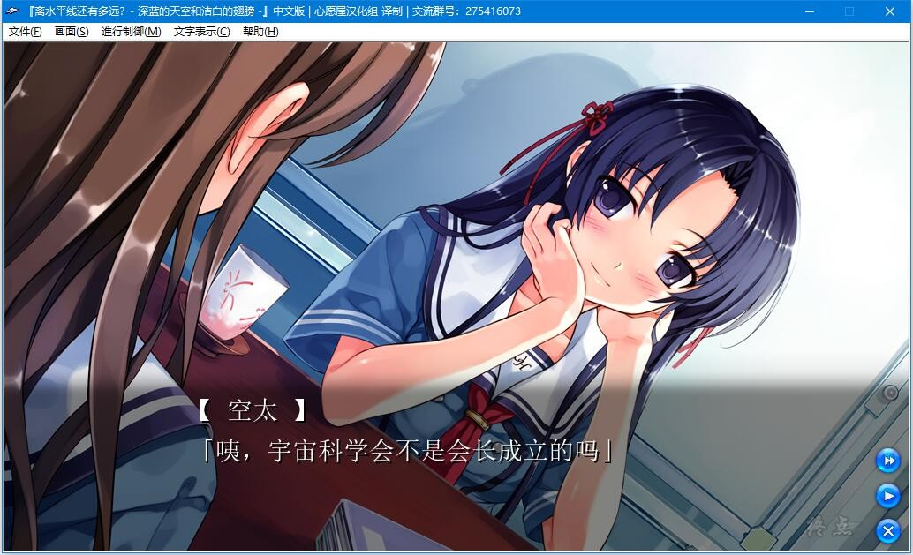

# 游戏简介

新制作商·ABHAR（アーヴァル）奉上的处女作是以近未来的学园为舞台的清新的青春物语。
演出了华丽的世界观的美轮美奂的绘画与音乐也是魅力所在！

这是一个所有人都能够轻松地飞翔于天空的，空中运动（Sky Sports）比以往任何时代都要兴盛的世界。
在这里，清澄的空气与美丽的大海无限地延伸，每个人都曾经乘上滑翔伞，享受空中散步。

某日，主人公平山空太所属的“宇宙科学会”因为没有进行过任何像样的活动，终于面临即将被解散的危机。
于是主人公他们决定倾尽全力参加世界首次“电动滑翔机竞赛（Motor Glider Contest）”。

一直以来没有认真地进行过活动的宇宙科学会，第一次聚集起全员的力量，开始与各种各样的问题与困难正面对峙……
在这个过程中逐渐显露出的同伴们的真实面貌与魅力、强烈的羁绊。

拼死挥洒青春的主人公他们，将会度过一个怎样的夏天呢——

心愿屋汉化组  汉化作品

ABHAR在2008年发售的纯爱作品，内置全CG存档

**请使用[IDM](https://www.123pan.com/s/jJprVv-3tMsH)进行下载，使用最新版[winrar](https://www.123pan.com/s/jJprVv-dtMsH)进行解压（非常重要）。**

**解压密码为终点（简体汉字）。**

**添加10%恢复记录，防止网盘抽风损坏。**

