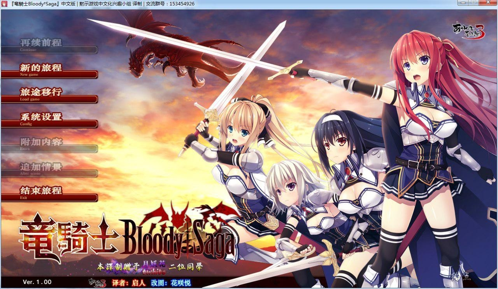
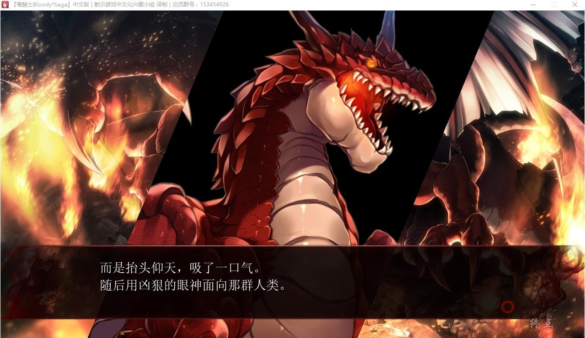
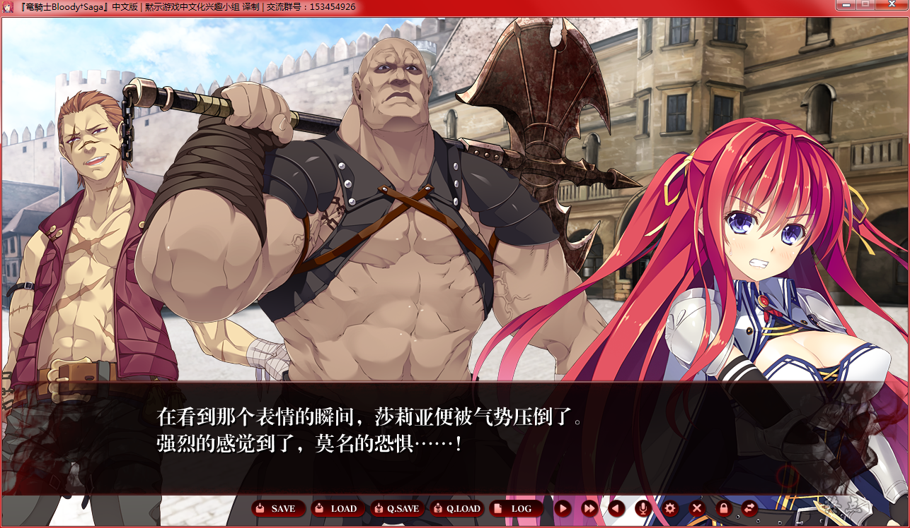
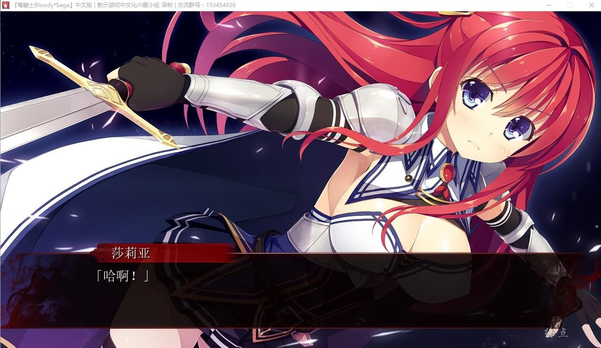
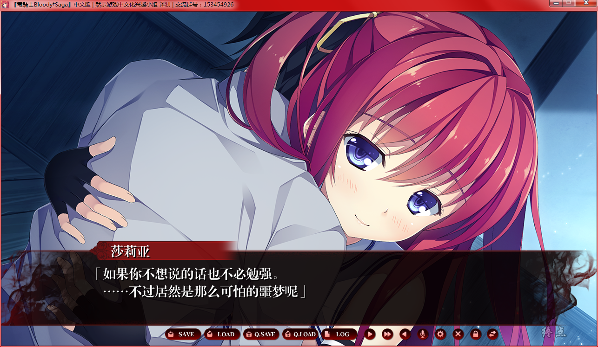
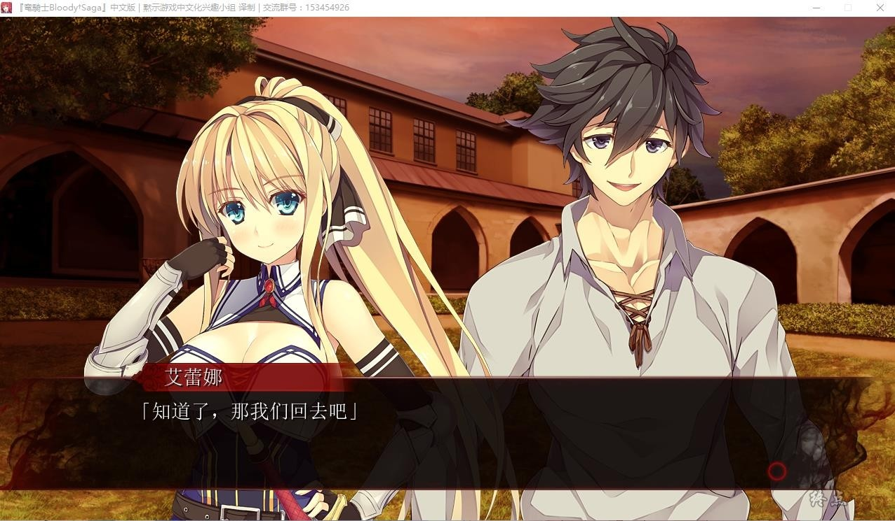

# 游戏简介

拥有着以人类之身完全无法与之对抗的强大力量的存在——“龙”。

尾巴一扫便可扫清一切，翅膀一振便可吹走一切。

即使聚集起由顽强的士兵组成的大军，也无法阻止龙的破坏。

除了一位英雄。

那个男人最后成为了王，有意在龙锁居住的山脉旁边建立起了国家。

正因为有龙的力量的影响，ヴィルディルン成为了一个任何国家都无法入侵的和平国家。

唯一的威胁，就是成为了对其它国家的抑制力的龙本身。

仿佛一时兴起一般，突然出现、突然作恶的龙。

为了从龙的威胁中保护人民，初代国王创建了一个骑士团。

与龙战斗的骑士——被称为“龙骑士”的骑士们，即使在初代国王去世后，也依然保护着这个国家。

骑士的力量即使加在一起也无法打倒龙。

但是，却可以赌上性命从龙的威胁中保护人民。

因此，有龙骑士存在的这个国家才能繁荣昌盛。

自ヴィルディルン建国起，时间已过了很久，一位青年造访了这个国家。

他还完全不知道。

在自己行走的方向前方，等着他的是与被称为“龙骑士”的少女们的邂逅。

还有，受龙的威胁的这个国家，将会转变成什么样子——

---

黙示  汉化作品

**详情请看 [汉化发布帖](https://tieba.baidu.com/p/6084350394)**

**2019-3-30 更新完整汉化版本**

**请使用[IDM](https://www.123pan.com/s/jJprVv-3tMsH)进行下载，使用最新版[winrar](https://www.123pan.com/s/jJprVv-dtMsH)进行解压（非常重要）。**

**解压密码为终点（简体汉字）。**

**添加10%恢复记录，防止网盘抽风损坏。**

