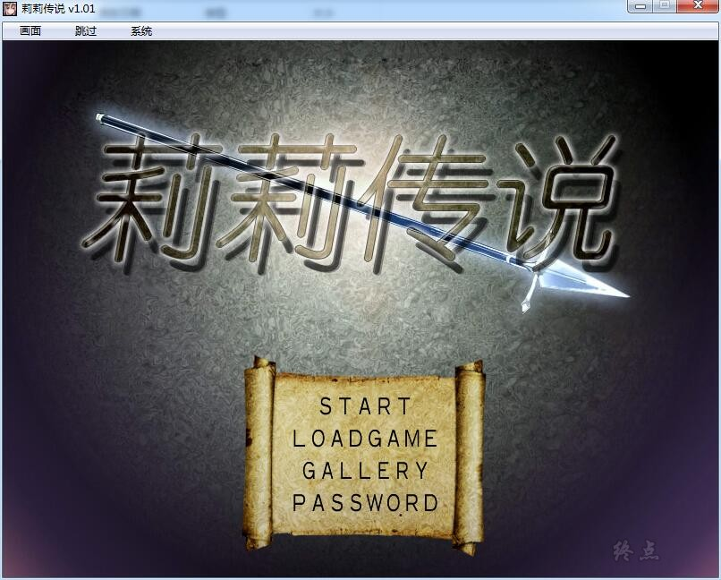
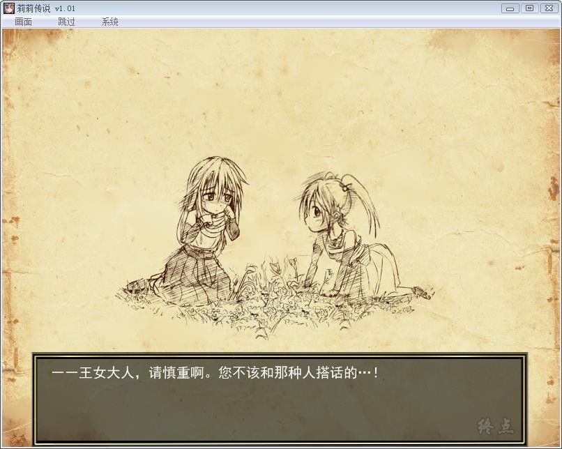
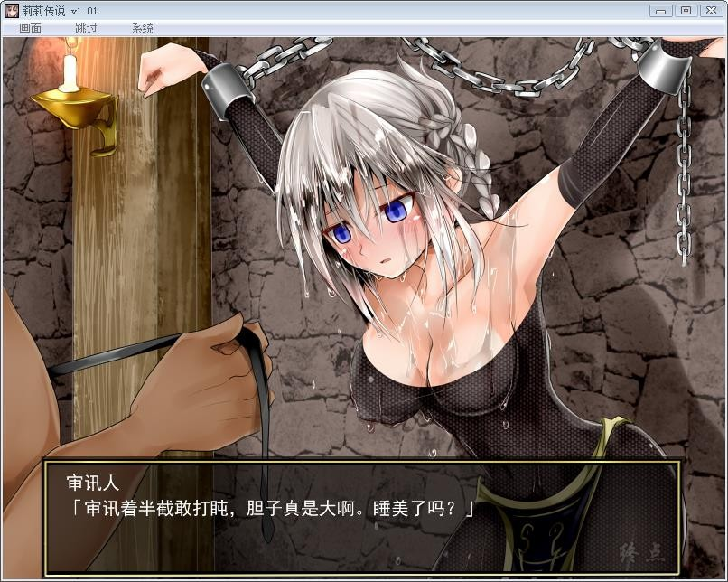
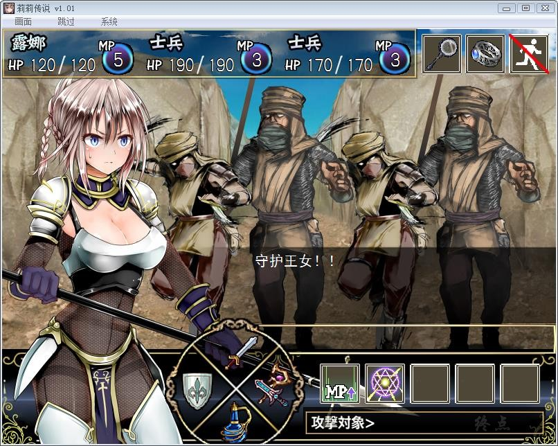
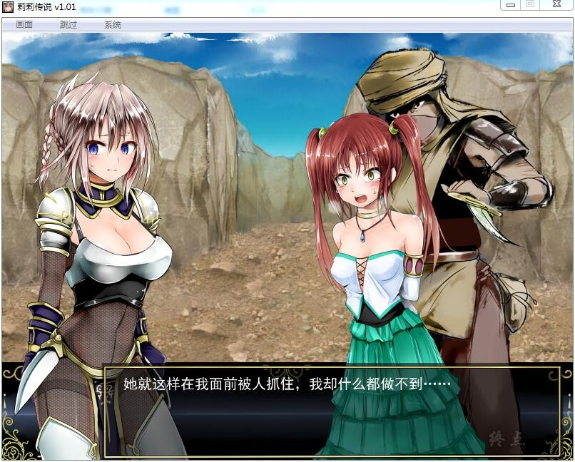
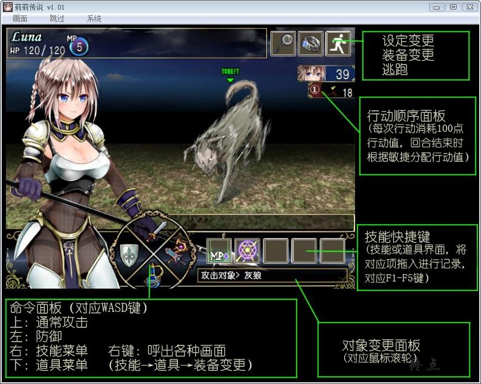

# 游戏简介

因被人断言为“恶魔之子”而饱受世人排斥的小女孩露娜利艾，偶然之下遇见了与自己同龄的古兰兹王国公主吉尔。

在后者不畏偏见的关怀下，露娜被骑士团长拉哈德收养，自从为了成为吉尔的骑士而努力着。

某一天，两人在骑士团的陪同下来到了王家的传承之地，以便在此地进行公主的成年礼与露娜的册封仪式。

但就在仪式之后，一伙不知从何处冒出的贼人突然对他们发动了袭击，骑士团在措不及防之下被瞬间击溃，
而公主则被贼人掳走，只余下露娜在被贼人头领种下蛊虫后独自一人生还回到古兰兹王国。

回到王国的露娜被冠上了罪人的帽子，随即便被关入了大牢。
在往日同伴的帮助之下，她星夜逃出了自己的祖国，成为了叛国之人。
为了洗清自己的冤屈并挽救自己的挚友吉尔，露娜独自踏上了寻回公主的荆棘之路……

**游戏包含2.0版本追加的全部内容，已打V2社保补丁（步兵）**

**游戏为终点论坛自购，转载请注明出处，谢谢配合。
[Steam地址](https://store.steampowered.com/app/1141100/Lilitales/) ，如有能力，还请支持正版**

**请使用[IDM](https://www.123pan.com/s/jJprVv-3tMsH)进行下载，使用最新版[winrar](https://www.123pan.com/s/jJprVv-dtMsH)进行解压（非常重要）。**

**解压密码为终点（简体汉字）。**

**添加10%恢复记录，防止网盘抽风损坏。**

