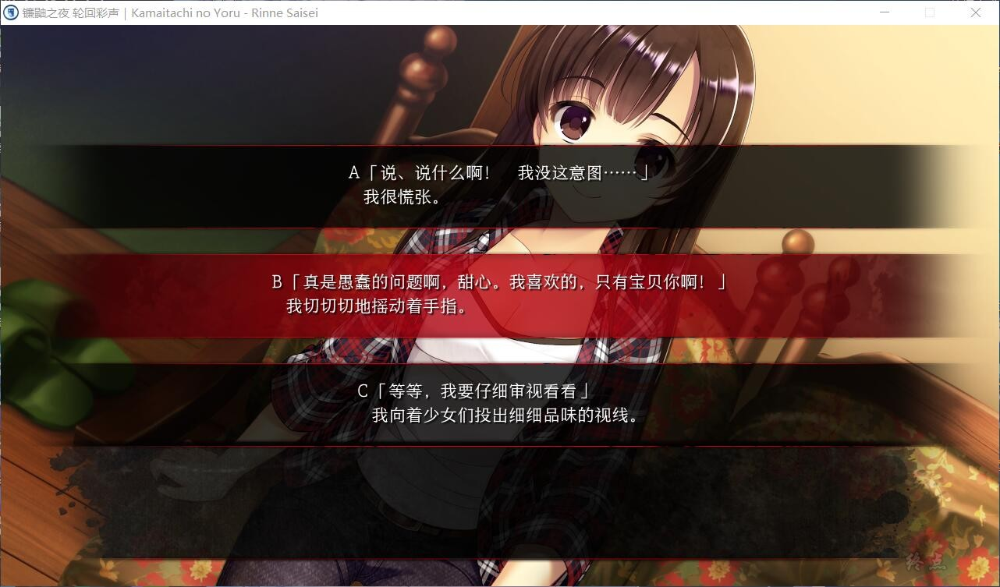
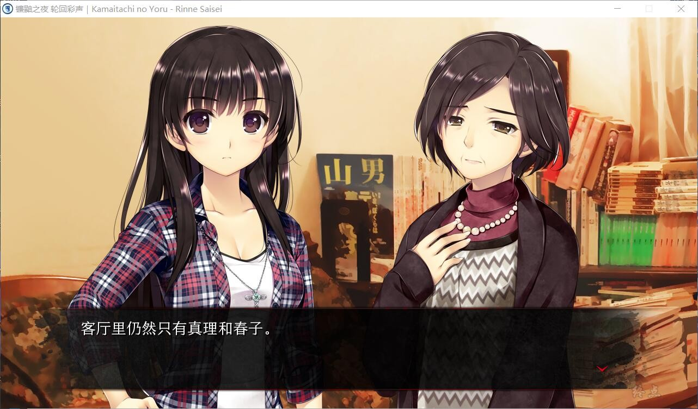

寒假，主人公・透和大学好友・真理结伴开始了滑雪旅行。
他们寄住在了真理的叔父・小林夫妻所经营的旅馆「シュプール」之中。
晚餐时，他们见到了下榻此处的形形色色的客人们。

晚饭后，在房客中的OL3人组的房间中，发现了“今晚，12点，有人会死”这样的字条。

当时，大家只是认为这可能是谁搞出来的恶作剧，但是当晚，悲剧真的发生了。
被分解的支离破碎的某个房客的尸体被发现了。
外面狂风暴雪，电话线也被切断了，而在这偏远的深山中，手机讯号也不通，众人陷入了与世隔绝的状态。
虽然大家同仇敌忾，但是事件却接连发生。

犯人到底藏在哪？还是说？
在疑神疑鬼之间，暴风雪的夜晚渐沉。
主人公两人到底能否解开事件的真相，从「シュプール」顺利逃出生天呢？

[汉化原帖](http://bbs.natsunokiseki.org/read.php?tid=18719&fid=81)

### PS：

我和CY测试时候，有跳出，在流程图的46号位置，原版也这样，万邪测试没问题，应该是个别现象
解决办法：第一次报错关闭，第二次打开就可以了。如果还报错，读档，或者流程图进入可破

**请使用[IDM](https://www.123pan.com/s/jJprVv-3tMsH)进行下载，使用最新版[winrar](https://www.123pan.com/s/jJprVv-dtMsH)进行解压（非常重要）。**

**解压密码为终点（简体汉字）。**

**添加10%恢复记录，防止网盘抽风损坏。**

