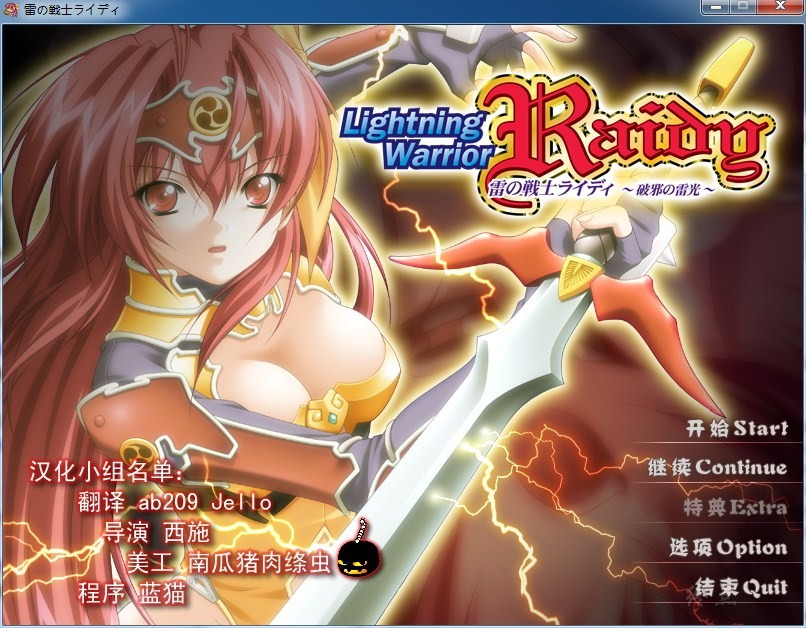

# 游戏简介

“我叫莱蒂，是在这叫作艾尔斯大陆上流浪的战士，因为能够自由地操纵雷电，别人都叫我“雷之战士”。

说起我为什么会站在这座塔前的话，原因在于我路过的一座名为萨德的村庄，那座村子是已经几乎成了无人村的荒凉村庄。其原因看来就是栖息在这座塔里的怪物们，它们把所有年轻的女子都抓进了塔里，而去救她们的年轻男人们都一去不返。听了这种事不能不管是我的性格，于是我就来到了这座塔前……”

日版标題：雷の戦士ライディ ～破邪の雷光～

年份：2005

原版《雷の戦士ライディ》于1994年发售，
这是基于原版做的重制版，
故事顺序为整个系列第一集。

**请使用[IDM](https://www.123pan.com/s/jJprVv-3tMsH)进行下载，使用最新版[winrar](https://www.123pan.com/s/jJprVv-dtMsH)进行解压（非常重要）。**

**解压密码为终点（简体汉字）。**

**添加10%恢复记录，防止网盘抽风损坏。**

